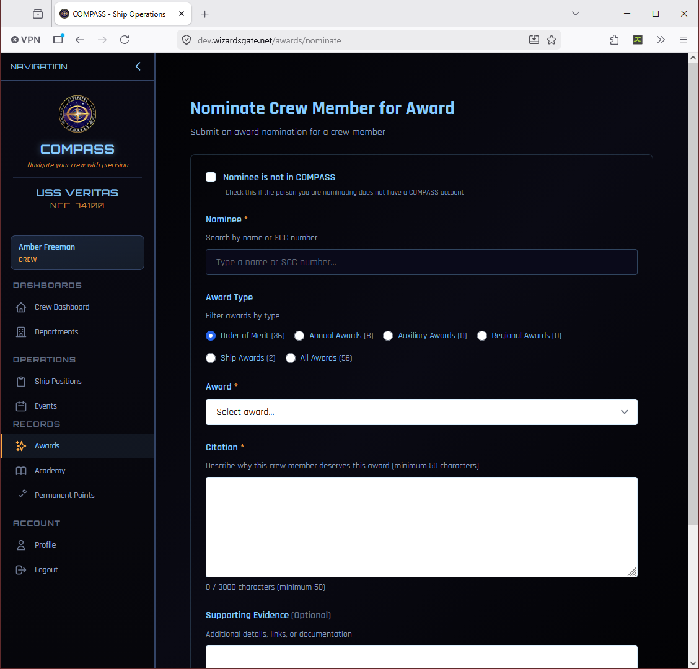
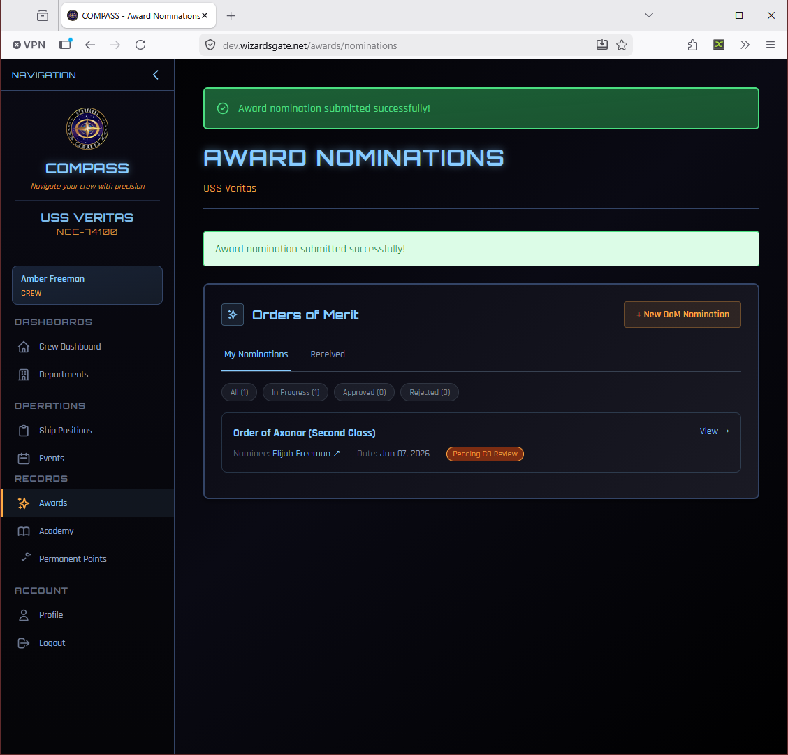
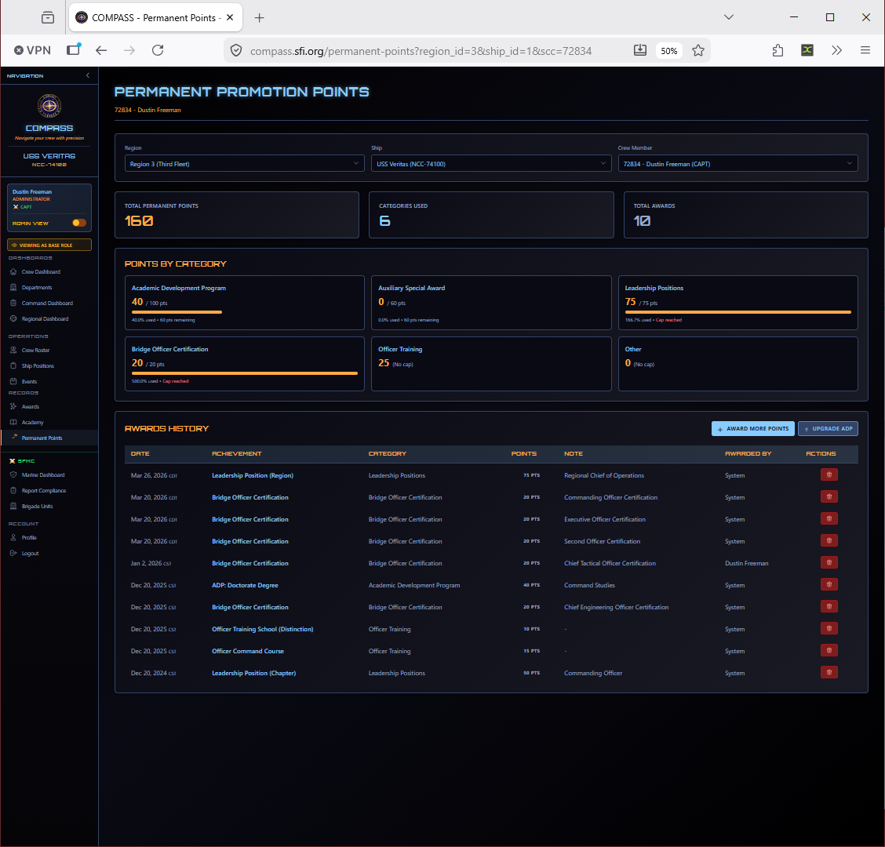

# Awards & Nominations

COMPASS manages the full awards workflow from CO nominations through regional approval and permanent point awards.

Go to **Awards** in the left navigation.

---

## Nominating a Crew Member

Go to **Awards → Nominate** (or click **Awards & Recognition** from the Command Dashboard).

The nomination form requires:

- **Nominee** — Search by name or SCC number. Check **Nominee is not in COMPASS** if nominating a member from outside the platform.
- **Award Type** — Filter the award catalog by category (Order of Merit, Annual Awards, Auxiliary Awards, Regional Awards, Ship Awards)
- **Award** — Select the specific award from the filtered list
- **Citation** — A narrative description of why the crew member deserves this award (minimum 50 characters, up to 3000)
- **Supporting Evidence** — Optional additional details, links, or documentation

!!! tip "Write a Good Citation"
    Be specific. *"For organizing three consecutive monthly meetings during the CO's LOA, maintaining 90% crew attendance"* is far stronger than *"for outstanding service."* The RC uses your citation when reviewing the nomination — a vague citation slows approval.

---

## After Submitting

Once submitted, your nomination is visible on the **Award Nominations** page with a status badge.

Nominations move through these statuses:

| Status | Meaning |
|---|---|
| **Pending CO Review** | Just submitted, awaiting your own review queue (for crew-submitted nominations) |
| **In Progress** | Under regional review |
| **Approved** | Approved — permanent points awarded automatically |
| **Rejected** | Not approved — a reason is provided |

---

## Award Categories

| Category | Examples |
|---|---|
| **Order of Merit** | SFI's primary award series — multiple classes and grades |
| **Annual Awards** | SFI annual cycle awards (CO of the Year, etc.) |
| **Auxiliary Awards** | SFMC and other auxiliary-specific awards |
| **Regional Awards** | Awards created and managed at the regional level |
| **Ship Awards** | Awards created by your ship's command staff |

Each award's point value is applied automatically to the member's permanent points upon approval.

---

## Permanent Points

Approved awards add to a member's permanent point total, which contributes to promotion eligibility. You can see a member's full permanent points breakdown by going to **Permanent Points** in the left navigation.

---

## Annual Awards

The SFI annual award cycle is managed separately from regular nominations. Nominations are submitted during a specific window announced by your RC. EC-level annual awards are voted on by the Executive Committee. Your RC will announce when the window opens — watch for that communication.

---

## RC-Level Award Workflow

For reference, once you submit a nomination your RC sees it in their regional awards queue for review and approval. The RC can approve directly or request changes.

.png)

---

## Common Issues

**Award not in the catalog.**
Contact your RC — the award catalog is managed at the regional and fleet level. Custom ship awards can be added by your RC on request.

**Points didn't update after approval.**
Refresh the member's profile. If still missing, contact the platform admin.

**I submitted with the wrong nominee.**
Contact your RC before it's approved — they can return it for correction.
