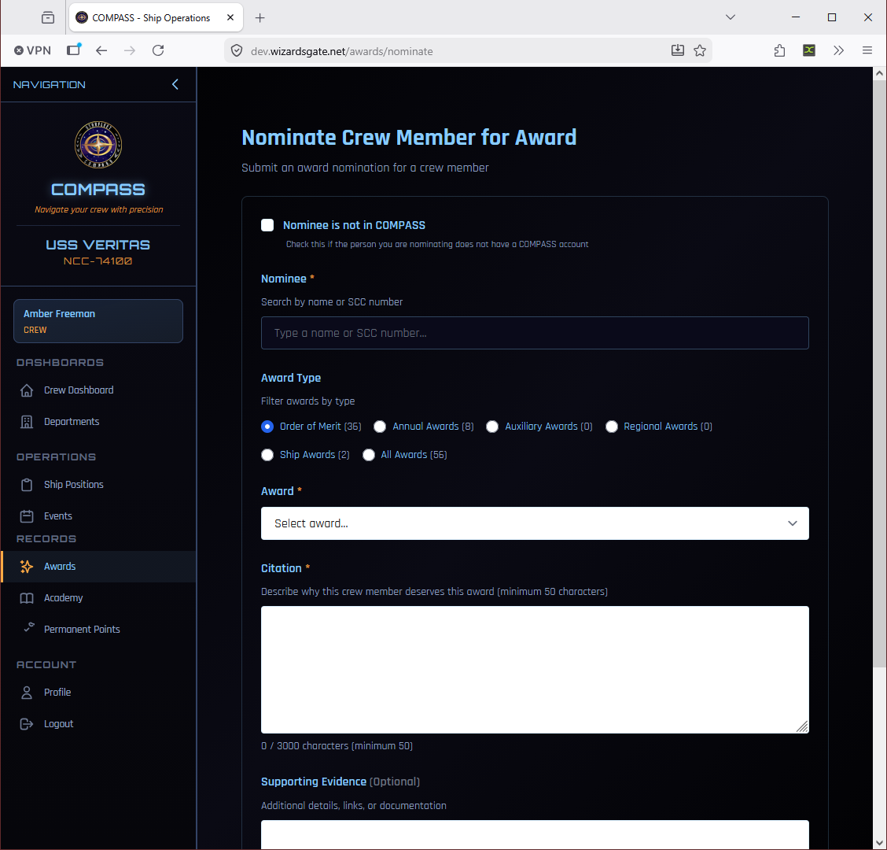
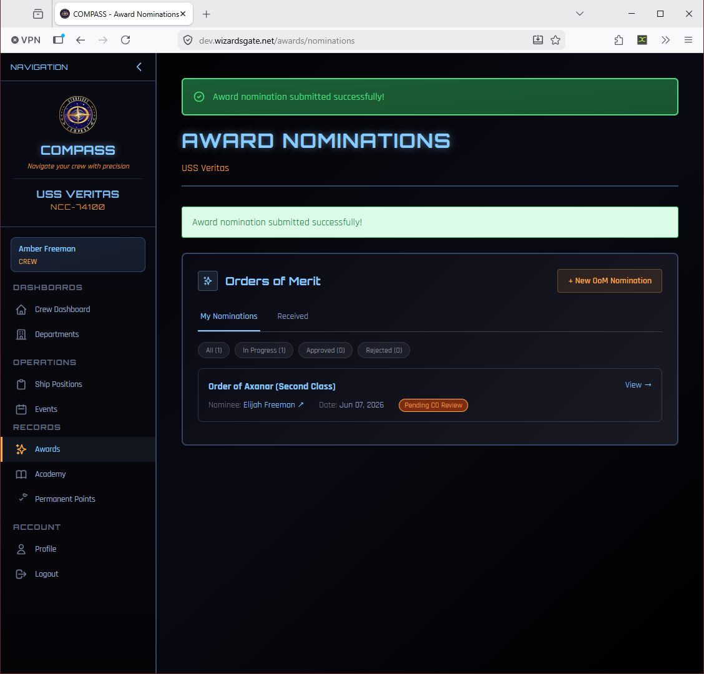
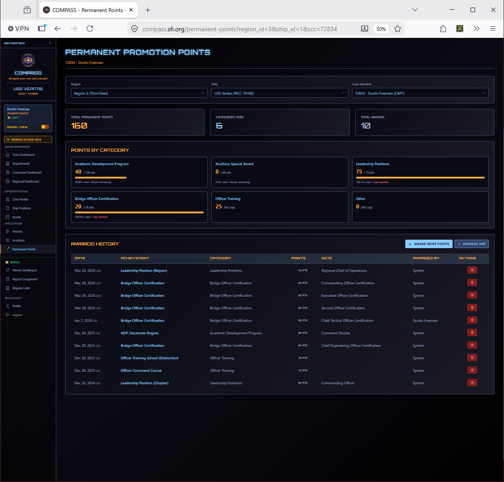

# Awards & Nominations

COMPASS manages the full awards workflow from CO nominations through regional approval and permanent point awards.

Go to **Awards** in the left navigation.

!!! tip "Approving, presenting, and submitting to SFI"
    These three are CO abilities, but a CO can delegate any of them to their XO — see [Delegating Command Authority](delegation.md). Nominating and giving awards need no grant; the XO can already do both.

---

## Nominating a Crew Member

Go to **Awards → Nominate** (or click **Awards & Recognition** from the Command Dashboard).

The nomination form requires:

- **Nominee** — Search by name or SCC number. Check **Nominee is not in COMPASS** if nominating a member from outside the platform.
- **Award Type** — Filter the award catalog by category (Order of Merit, Annual Awards, Auxiliary Awards, Regional Awards, Ship Awards)
- **Award** — Select the specific award from the filtered list
- **Citation** — A narrative description of why the crew member deserves this award (minimum 50 characters, up to 3000)
- **Supporting Evidence** — Optional additional details, links, or documentation

!!! tip "Write a Good Citation"
    Be specific. *"For organizing three consecutive monthly meetings during the CO's LOA, maintaining 90% crew attendance"* is far stronger than *"for outstanding service."* The RC uses your citation when reviewing the nomination — a vague citation slows approval.

---

## After Submitting

Once submitted, your nomination is visible on the **Award Nominations** page with a status badge.

Nominations move through these statuses:

| Status | Meaning |
|---|---|
| **Pending CO Review** | Just submitted, awaiting your own review queue (for crew-submitted nominations) |
| **In Progress** | Under regional review |
| **Approved** | Approved — permanent points awarded automatically |
| **Rejected** | Not approved — a reason is provided |
| **Approved – ACTION REQUIRED: Email to SFI** | Order of Merit only. Approved in COMPASS but **not yet sent to SFI** — see [Sending an Order of Merit to SFI](#sending-an-order-of-merit-to-sfi) |
| **Submitted to SFI** | The form has been emailed; waiting on SFI's decision |
| **Awarded by SFI** / **Rejected by SFI** | SFI's decision, recorded in COMPASS once it arrives |

---

## Sending an Order of Merit to SFI

!!! warning "Approving an Order of Merit does not send it to SFI"
    COMPASS prepares the paperwork, but **you** send it. Until you email the form and mark it submitted, the nomination sits with you and SFI never sees it.

The moment an Order of Merit is approved, COMPASS stops you with this reminder:

.png)

### The three steps

1. **Download the OoM form.** Click **Download OOM Form (PDF)** — in the pop-up, in the reminder banner, or on the nomination page. The form comes pre-filled with the nominee, nominator, chapter, and citation.
2. **Email it to the Merits Director** — *SFI MemServ - Merits Director* at **merit@sfi.org**, with the PDF attached. The **Open email to merit@sfi.org** button on the nomination page starts the email with the subject filled in; you still attach the PDF yourself.
3. **Click Mark as Submitted to SFI** on the nomination. This is what tells COMPASS the job is done.

The nomination page lays the same steps out at the top of the submission panel:

.png)

**Mark as Submitted to SFI** is at the bottom of that panel, below the reference copy of the form data. COMPASS asks you to confirm you have emailed the form before it records the submission.

.png){ width="260" }

### Until you do, COMPASS keeps reminding you

A banner sits at the top of **every page** until each nomination is marked submitted. It can't be dismissed. Each row links to the nomination and to its form, and the banner changes colour as the nomination waits: amber at first, orange after 7 days, red after 14.

.png)

Your dashboard also shows a red card for them:

.png)

??? note "On a phone"
    The banner appears the same way on a phone, above the page content.

    .png){ width="300" }

### After you mark it submitted

The status changes to **Submitted to SFI** and the reminders clear. When SFI replies, open the nomination and click **Awarded by SFI** or **Rejected by SFI**. Awarded puts the award on the member's record — or holds it for presentation, if the nomination was set to *Hold until presented*.

### Who can send it

The CO of the nominee's chapter, or the XO if you've delegated submitting to SFI (see [Delegating Command Authority](delegation.md)). The region's RC, VRC and RAO can also send it and see the same reminders. Whoever sends it should mark it submitted, so it isn't emailed twice.

---

## Award Categories

| Category | Examples |
|---|---|
| **Order of Merit** | SFI's primary award series — multiple classes and grades |
| **Annual Awards** | SFI annual cycle awards (CO of the Year, etc.) |
| **Auxiliary Awards** | SFMC and other auxiliary-specific awards |
| **Regional Awards** | Awards created and managed at the regional level |
| **Ship Awards** | Awards created by your ship's command staff |

Each award's point value is applied automatically to the member's permanent points upon approval.

---

## Permanent Points

Approved awards add to a member's permanent point total, which contributes to promotion eligibility. You can see a member's full permanent points breakdown by going to **Permanent Points** in the left navigation.

---

## Annual Awards

The SFI annual award cycle is managed separately from regular nominations. Nominations are submitted during a specific window announced by your RC. EC-level annual awards are voted on by the Executive Committee. Your RC will announce when the window opens — watch for that communication.

---

## RC-Level Award Workflow

For reference, once you submit a nomination your RC sees it in their regional awards queue for review and approval. The RC can approve directly or request changes.

.png)

---

## Common Issues

**Award not in the catalog.**
Contact your RC — the award catalog is managed at the regional and fleet level. Custom ship awards can be added by your RC on request.

**Points didn't update after approval.**
Refresh the member's profile. If still missing, contact the platform admin.

**I submitted with the wrong nominee.**
Contact your RC before it's approved — they can return it for correction.
