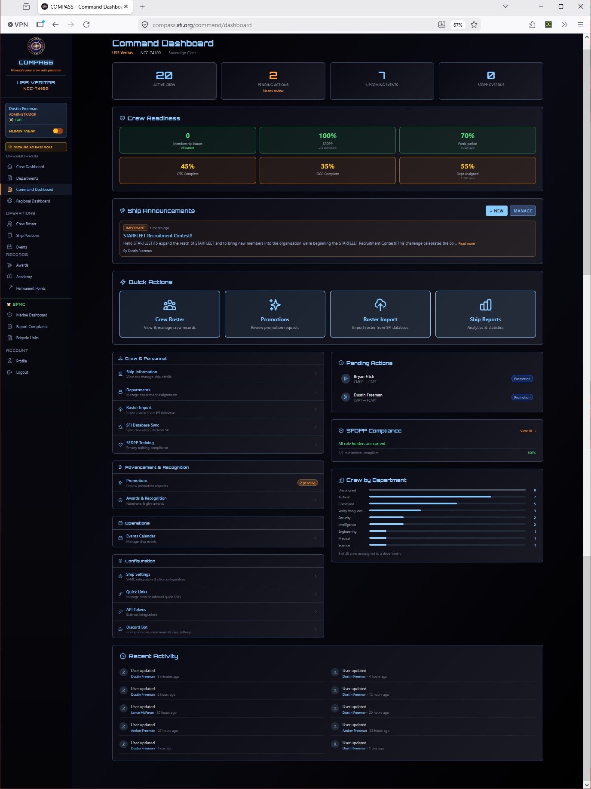

# Command Dashboard

The Command Dashboard is your primary hub in COMPASS. It's the first page you see after logging in as CO or XO, and gives you a full operational picture of your ship at a glance.

---

## Dashboard Sections

### Crew Management

Quick links for the most common roster operations:

| Link | Purpose |
|---|---|
| **Ship Information** | View and edit your ship's details |
| **Departments** | Manage department assignments |
| **Roster Import** | Import or re-sync your roster from the SFI database |
| **SFI Database Sync** | Sync crew eligibility data from db.sfi.org |
| **SFDPP Training** | View privacy training compliance |

### Advancement & Recognition

| Link | Purpose |
|---|---|
| **Promotions** | Review and submit promotion requests — shows a badge count for pending items |
| **Awards & Recognition** | Nominate crew and manage award submissions |

### Operations

| Link | Purpose |
|---|---|
| **Events Calendar** | Create events and manage attendance |

### Configuration

| Link | Purpose |
|---|---|
| **Ship Settings** | Point values, promotion requirements, SFMC integration |
| **Quick Links** | Customize the links shown on the crew member dashboard |
| **API Tokens** | Manage external integration tokens |
| **Discord Bot** | Configure Discord role sync, nicknames, and sync settings |

---

## Status Panels (Right Column)

### Pending Actions

Shows promotion and award submissions that require your attention, with a direct action button for each. If you have pending items, this panel will always be visible on the dashboard. Clearing your pending actions regularly keeps the workflow moving for your crew.

### SFDPP Compliance

Shows whether all role holders (CO, XO, and department heads) have completed current SFDPP privacy training. Displays a compliance percentage and a **View all** link to see the full breakdown.

!!! tip
    SFDPP compliance is required for command roles. If this shows less than 100%, follow up with the listed crew members before your next report cycle.

### Crew by Department

A horizontal bar chart showing how many crew are assigned to each department. Also shows the count of crew not yet assigned to any department — a useful indicator that your roster needs attention.

---

## Recent Activity

The bottom of the dashboard shows a timestamped feed of recent platform activity — profile updates, new crew additions, event entries, and more. Useful for keeping tabs on what's been entered (or not entered) without digging into individual records.

---

## Navigation

The left sidebar provides access to all COMPASS sections. The top of the sidebar shows your ship name and your current role. As CO or XO, you'll see all sections. Crew members see a reduced set.

!!! note
    If you hold both a ship-level role (CO/XO) and a regional role (RC/VRC), you'll see both the Command Dashboard and Regional Dashboard in the navigation.
