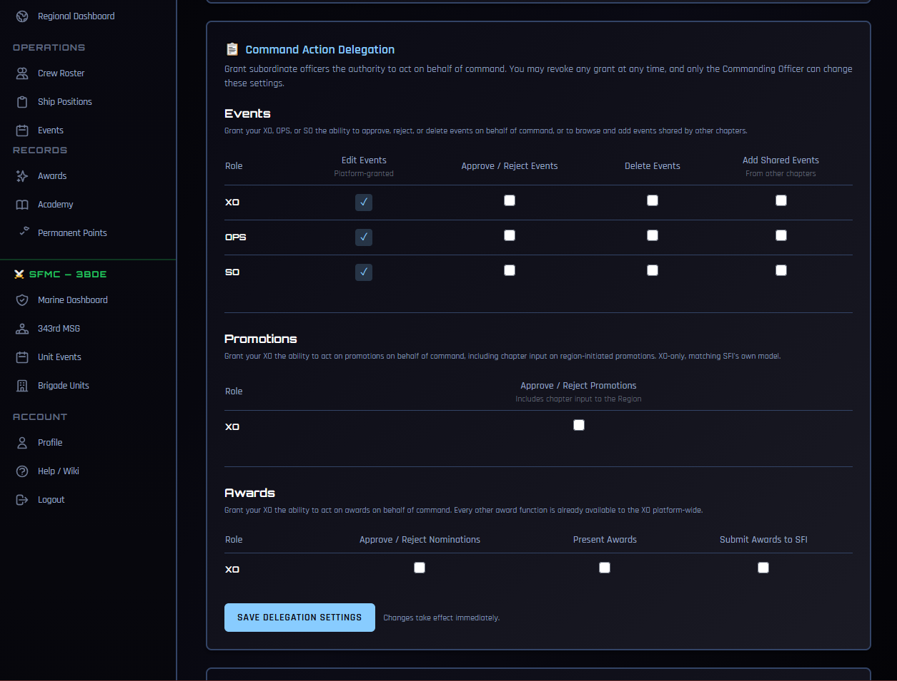

# Delegating Command Authority

Some things in COMPASS only the Commanding Officer can do. That is usually right — but not always. A CO goes on vacation, has a medical stretch, deploys, or simply finds the platform more work than it is worth. Meanwhile promotions sit unapproved and award nominations go stale.

Command Action Delegation lets a CO hand specific authority to their XO — or, for events, to OPS and SO as well. The CO decides what to grant, and can take it back at any moment.

!!! note "Delegation does not transfer command"
    Nothing here changes who commands the chapter. It grants the ability to perform specific actions in COMPASS, nothing more. The CO remains the CO, keeps every one of these abilities themselves, and is the only person who can change these settings.

---

## Where to Find It

Go to **Command Dashboard → Ship Settings** and scroll to **Command Action Delegation**.

Only the CO sees this card. An officer holding delegated authority cannot open it, and so cannot widen their own grant or hand authority to someone else.

---

## What Can Be Delegated

### Events — XO, OPS, or SO

| Action | What it allows |
|---|---|
| **Approve / Reject Events** | Act on events crew members have submitted |
| **Delete Events** | Remove events from the ship calendar |
| **Add Shared Events** | Browse events shared by other chapters and add them to your calendar |

**Edit Events** shows a locked checkmark. Your XO, OPS, and SO can already edit events platform-wide — that is not something the CO grants, and it cannot be revoked here.

### Promotions — XO only

| Action | What it allows |
|---|---|
| **Approve / Reject Promotions** | Act on promotions submitted for your crew, and give chapter input on region-initiated promotions |

Promotions are XO-only, matching how SFI itself handles this: XOs already hold promotion authority on the member portal. OPS and SO are not offered.

### Awards — XO only

| Action | What it allows |
|---|---|
| **Approve / Reject Nominations** | Act on award nominations submitted for your crew |
| **Present Awards** | Record awards as presented |
| **Submit Awards to SFI** | Send approved nominations on to STARFLEET |

These three are the only award functions restricted to the CO. Everything else — nominating, giving awards, managing your ship's award catalog, setting point overrides — your XO can already do without any grant.

---

## Granting and Revoking

Check the boxes you want, then click **Save Delegation Settings**. Changes take effect immediately — the officer does not need to log out and back in.

Revoking works the same way: uncheck the box and save. The officer loses that ability at once.

!!! tip "Turn it on before you leave, not after"
    Delegation is easiest to set up while you still have time to check it worked. If you know you'll be away, grant what your XO will need before you go rather than trying to sort it out from a phone in an airport.

---

## What Your XO Sees

**Before you grant anything**, your XO can already see the pending queues — the Pending Approvals tab under Promotions, and pending nominations under Awards. They have always been able to see these. What they lack is any way to act: no Approve button, no Reject button.

**After you grant**, those buttons appear. Your XO works the same screens you do, in exactly the same way.

Officers holding delegated authority also start receiving the pending-action notifications you get — the push and email alerts telling them something is waiting. Without that, they could act but would never know there was anything to act on.

---

## Limits That Always Apply

A few things hold regardless of what is granted:

- **No acting on yourself.** An officer working under delegated authority cannot approve their own promotion or their own award nomination.
- **Your chapter only.** Delegated authority stops at your ship. It never extends to another chapter's crew, even for a member the officer knows.
- **Per ship.** A grant applies to the ship it was made on. An officer serving on two ships holds only what each CO granted separately.
- **The CO keeps everything.** Granting an ability never removes it from the CO.

Every action taken under delegation is recorded as such. The record shows both who performed it and that it was done under delegated authority rather than by the officer's own permission — useful later when reconstructing who did what and why.

---

## Speaking to the Region

Promotion delegation includes one thing worth understanding before you grant it.

When a Regional Coordinator initiates a promotion for one of your members, COMPASS asks the chapter for input — a recommendation, or chapter-accomplishment examples. With promotion authority delegated, **your XO answers those requests on behalf of the chapter**, and the RC sees the chapter's response.

This is deliberate. The moment a CO is unavailable is exactly when a region-initiated promotion would otherwise stall. But it does mean your XO speaks for the chapter to the region, so grant it to someone you would trust to do that.

---

## Common Issues

**My XO says the Approve button still isn't there.**
Confirm the box is checked and saved on **your** ship's settings — the card always edits the ship you command. Then have them reload the page. If they serve on more than one ship, the grant only applies to the one you made it on.

**I unchecked a box but it came back.**
Make sure you clicked **Save Delegation Settings** after unchecking. The grid does not save on click.

**My XO can't approve a particular promotion.**
Check whether the promotion is theirs. An officer cannot act on their own promotion under delegated authority — that one has to come to you.

**I don't see the Command Action Delegation card at all.**
Only the CO sees it. If you are the XO, this is expected. If you are the CO and it is missing, your COMPASS role may not be set to CO — check **Crew Roster** or contact your RC.

---

## Related

- [Ship Settings](ship-settings.md) — the rest of what the CO controls per ship
- [Promotions](promotions.md) — how the promotion workflow runs
- [Awards & Nominations](awards.md) — the award nomination lifecycle
- [Sharing Events Between Chapters](event-sharing.md) — what Add Shared Events unlocks
