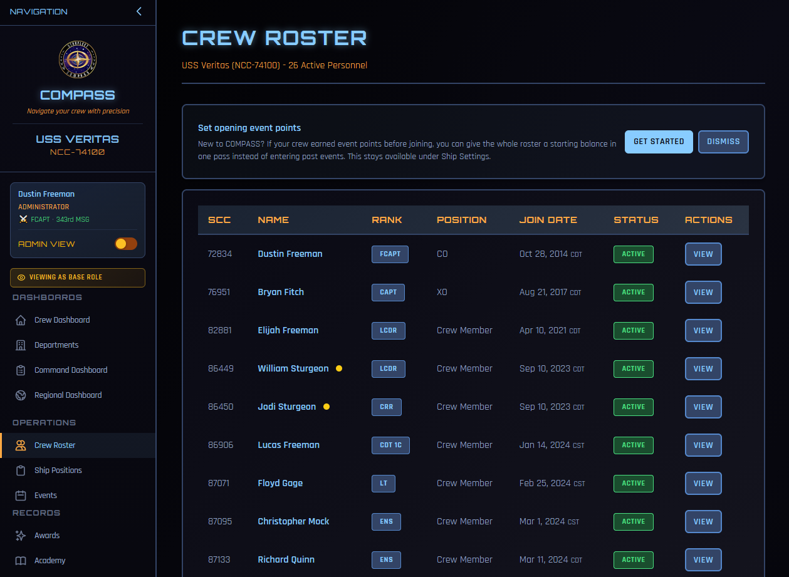
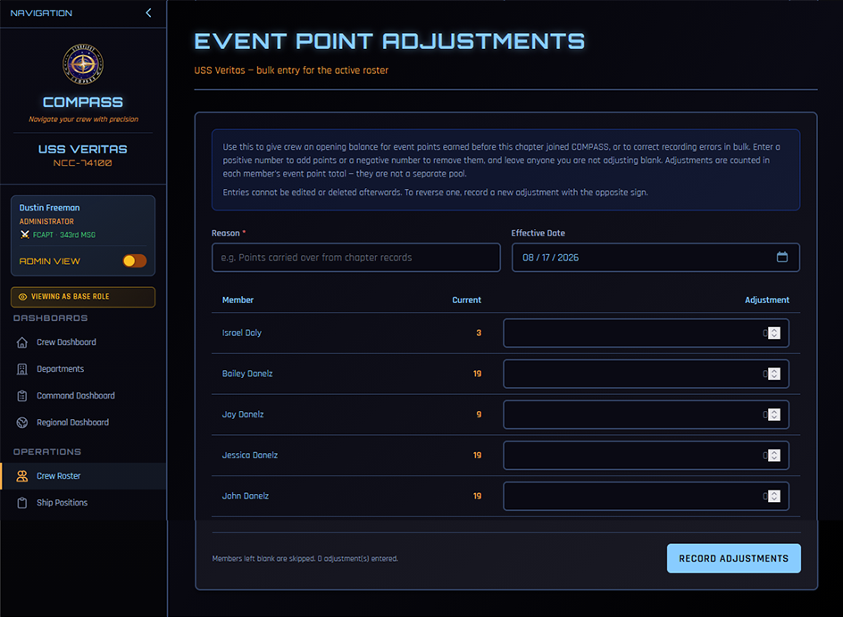
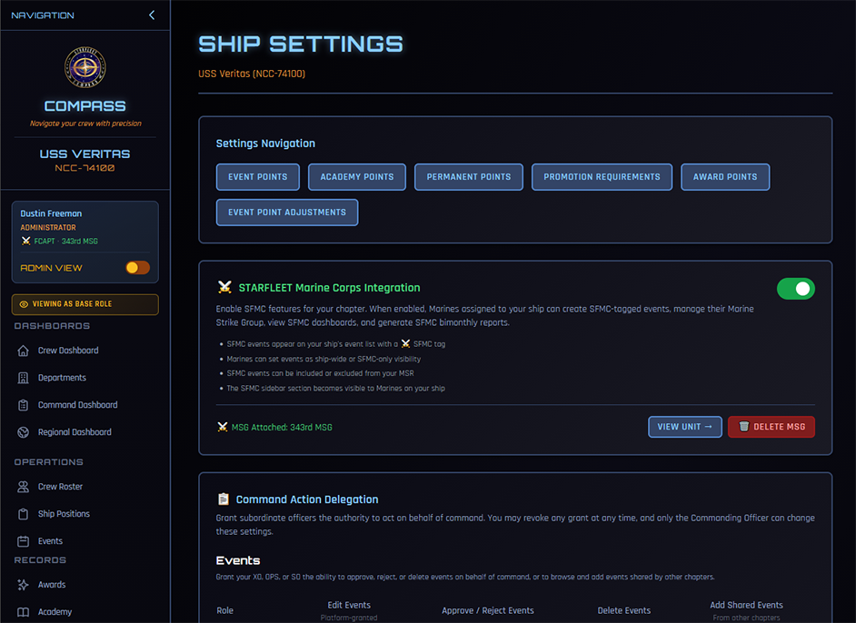

# Opening Event Points

Most chapters do not join COMPASS on their founding day. They arrive with years of history — meetings held, events run, crew who have earned hundreds of activity points that exist only in a spreadsheet or the outgoing CO's memory.

Entering all of that event by event is not realistic. **Event point adjustments** let you give your crew a starting balance in one pass, so promotions calculate correctly from day one without reconstructing the past.

!!! note "This is not a separate pool"
    An adjustment is folded into the member's event point total. A member with 12 recorded points and a 45-point adjustment simply has 57 event points. Nothing anywhere shows the two figures apart.

---

## When You Would Use This

- **Joining COMPASS** — give the roster the balance they carried in. This is the main case.
- **Correcting a recording error** — an event was entered twice, or attendance was recorded for the wrong person.
- **Reconciling with chapter records** — your own records and COMPASS disagree, and yours are right.

If you simply forgot to record a recent event, enter the event instead. Adjustments are for history you cannot reasonably reconstruct.

---

## The Prompt on Your Roster

New chapters see a prompt at the top of the Crew Roster.

**Get Started** opens the bulk entry page. **Dismiss** hides the prompt for you.

The prompt disappears on its own once your chapter records its first adjustment, so it is not something you have to clear. Dismissing costs you nothing either — the tool stays available under Ship Settings permanently.

!!! tip "Dismissal is per person"
    If you dismiss it, your XO still sees it, and the other way round. Neither of you can hide it from the other.

---

## Entering Balances for the Whole Roster

The bulk page lists your active roster with one entry box per member.

**Reason** and **Effective Date** apply to every member you enter on this page. One reason covers the batch — something like *Points carried over from chapter records* — so you are not typing it thirty times.

**Current** shows each member's event points as they stand now, so you can see what you are adding to.

In the **Adjustment** box, enter a positive number to add points or a negative number to remove them. **Leave blank anyone you are not adjusting** — blanks are skipped, so a roster of forty where six need changes means filling in six boxes.

The counter above the button tracks how many entries you have made. Click **Record Adjustments** and confirm.

!!! warning "Entries cannot be edited or deleted"
    Once recorded, an adjustment is permanent. To reverse one, record a new adjustment with the opposite sign — enter `-45` to undo a `+45`. This is deliberate: it keeps an honest history of what was changed and when, rather than letting the record be quietly rewritten.

---

## Adjusting One Member

For a single member, open their crew profile and scroll to **Event Point Adjustments** below their event participation. Same fields — points, date, reason — plus a history of every adjustment on that member showing who made it.

The history panel is visible only to the CO and XO.

---

## Finding It Later

The prompt on your roster goes away, but the tool does not. It lives at **Command Dashboard → Ship Settings → Event Point Adjustments** alongside your other point configuration.

---

## Who Can Do This

The CO and XO. Not OPS, SO, or department heads.

The reasoning: recording points for an event that actually happened is an operations task, and plenty of people can do it. Asserting points that were never recorded in COMPASS is a command decision, and it belongs with command.

---

## What This Does Not Change

Adjustments affect **event points only**. They do not touch academy points, award points, permanent points, or time in grade. A member short on time in grade stays short on time in grade no matter what you enter here.

They also do not appear as attendance. Your event statistics, attendance counts, and uniform compliance figures are unaffected — those reflect events that actually happened.

---

## Common Questions

**How do I work out what to give someone?**
Whatever your chapter's own records say they had earned. There is no formula COMPASS can supply — it never saw those events. If your records are approximate, be conservative: a member who is slightly under can earn the difference, while one who is over may get promoted early.

**Can I give someone a negative balance?**
Yes, and the total can go below zero if you over-correct. That is a real state, not an error, and it means the member earns their way back up before qualifying. If it was not what you intended, record another adjustment to bring them back.

**What happens to these points at promotion?**
Nothing special. Adjusted points are event points, and they are spent on promotion exactly as recorded ones are.

**Someone transferred in from another chapter — do their points follow?**
Yes. Event points, including adjustments, follow the member rather than staying with the chapter.

**Is there a record of who did this?**
Yes. Every adjustment stores the points, reason, date, and the officer who entered it, and the entry cannot be edited or removed. The per-member history on the crew profile shows all of it.

---

## Related

- [Ship Settings](ship-settings.md) — the rest of your ship's point configuration
- [Getting Started](getting-started.md) — bringing your chapter onto COMPASS
- [Promotions](promotions.md) — how points feed promotion eligibility
- [Events](events.md) — recording events and attendance going forward
