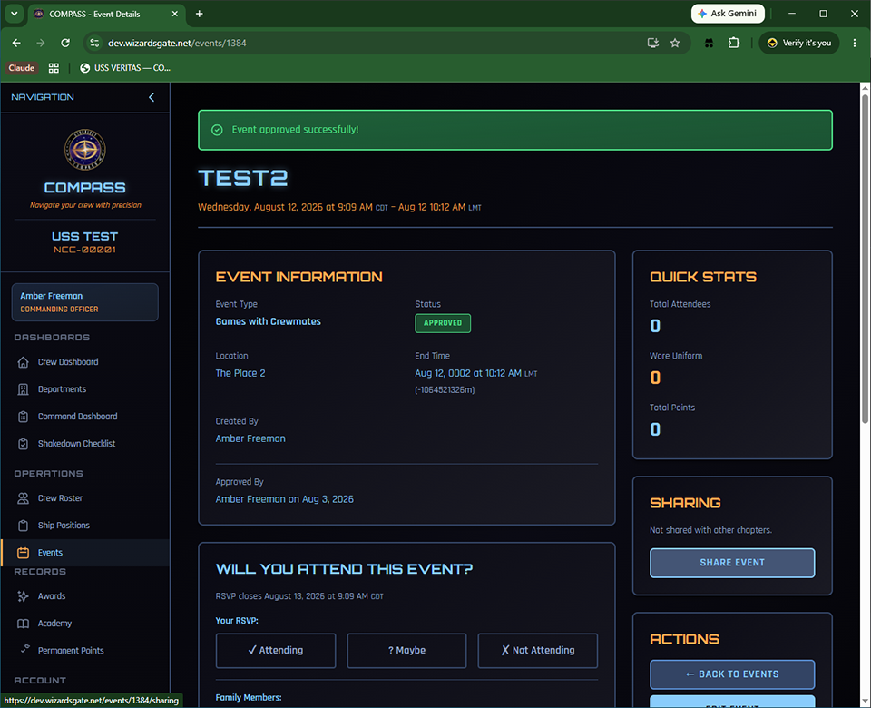
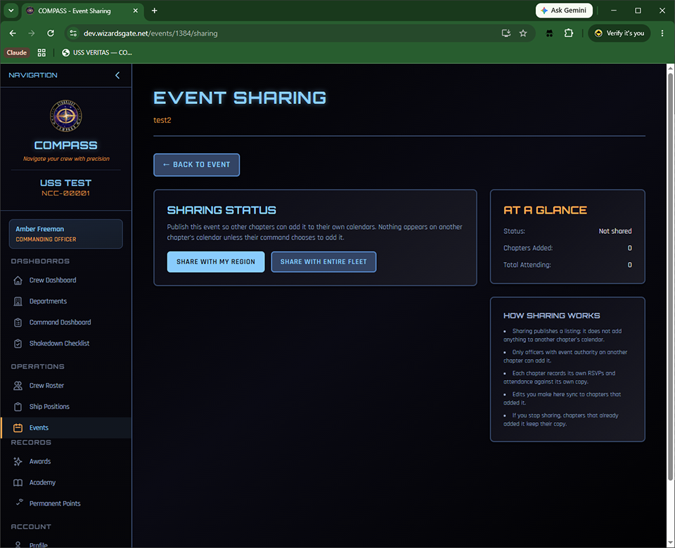
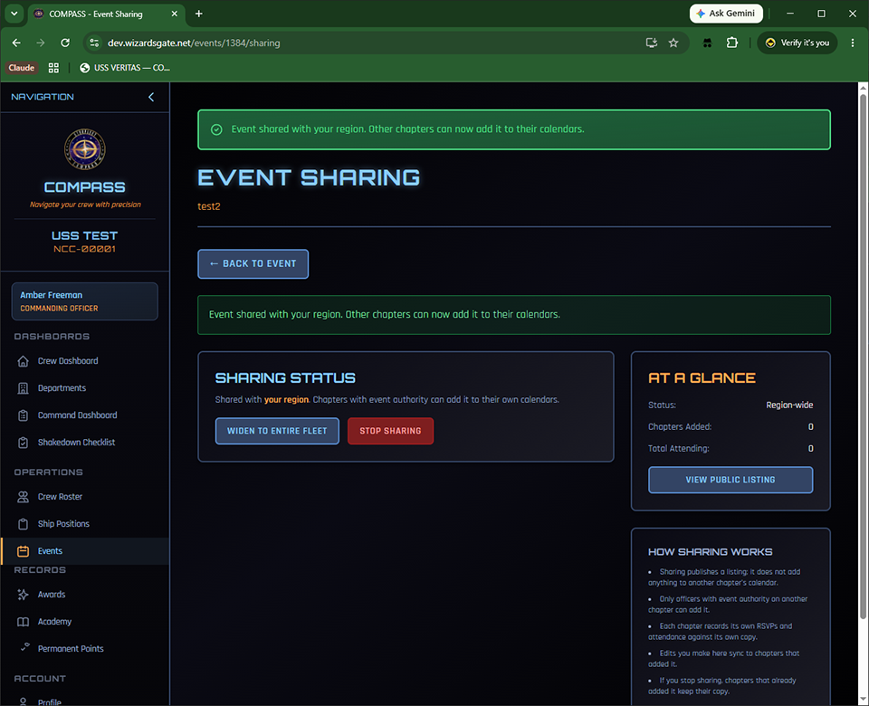
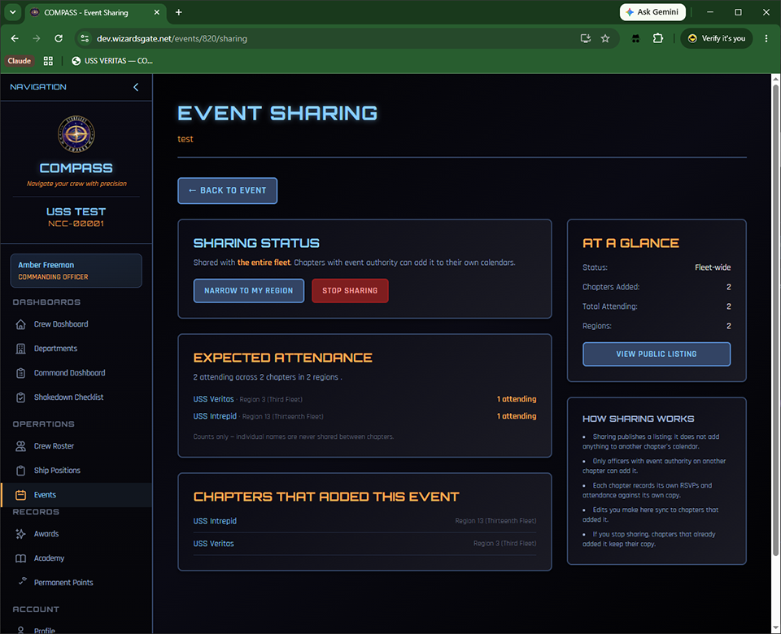
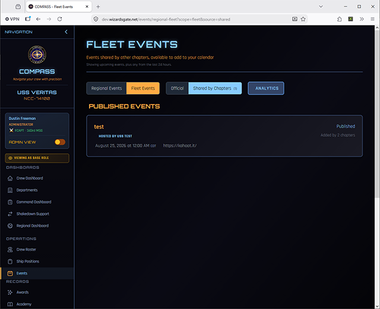
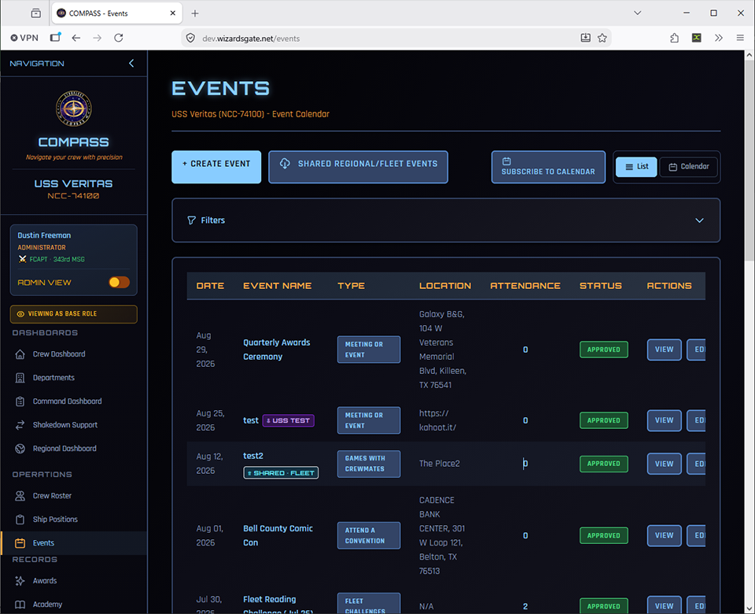
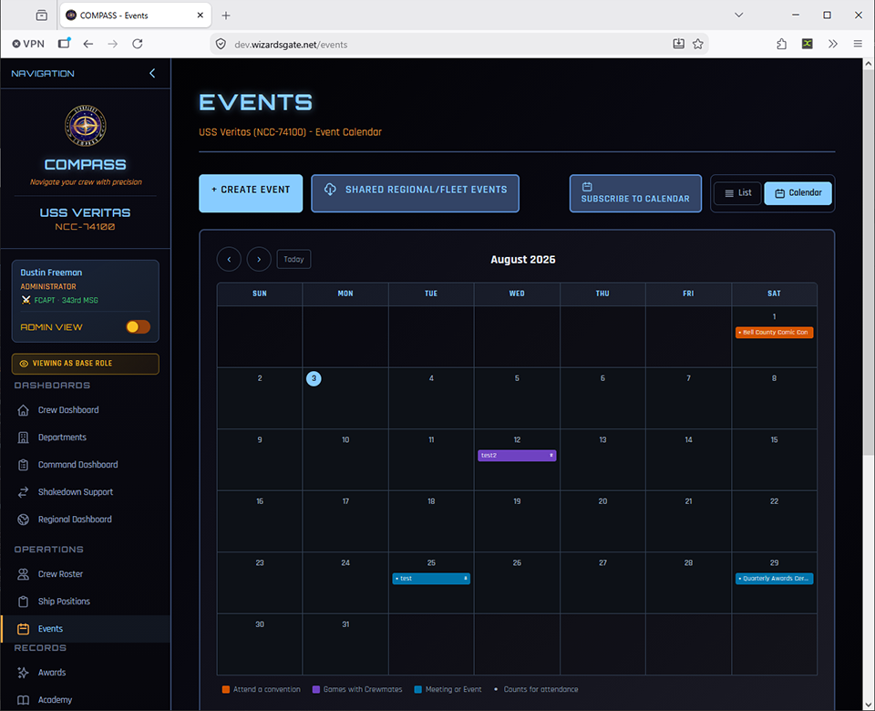

# Sharing Events Between Chapters

Some events are worth more than one chapter. A charity drive, a convention appearance, a virtual game night, a commissioning ceremony — any of these might draw members from neighboring chapters if they knew about it.

Event sharing lets your ship publish one of its events to **your region** or to the **entire fleet**. Officers at other chapters can then add it to their own calendar, where their crew RSVP and earn attendance credit exactly as they would for any other event.

!!! note "Sharing publishes a listing — it does not touch anyone's calendar"
    Sharing an event does **not** add it to another chapter's calendar. It makes the event visible to officers at other chapters, who decide for themselves whether to add it. Nothing appears on another ship's roster unless their command chooses it.

---

## Who Can Do What

| Action | Who |
|---|---|
| Share an event with your **region** | CO, XO |
| Share an event with the **entire fleet** | CO |
| View and add events shared by other chapters | CO, XO — plus any officer the CO delegates it to |

Crew members never see the shared events list. They see only the events their own command has added to the ship calendar.

---

## Sharing One of Your Events

### Step 1 — Open the event

Open an approved event on your ship from **Events**. In the right-hand column, between **Quick Stats** and **Actions**, you'll find the **Sharing** panel showing the current state.

Click **Share Event**.

### Step 2 — Choose your audience

The sharing page offers the options your permissions allow.

- **Share With My Region** — visible to chapters in your region only. The right choice for most in-person events, since geography does the filtering for you.
- **Share With Entire Fleet** — visible to every chapter. Best reserved for virtual events, major conventions, and anything genuinely open to members anywhere.

### Step 3 — Manage the share

Once published, the page shows the current scope and tracks uptake.

From here you can:

- **Widen to Entire Fleet** — promote a regional share fleet-wide
- **Narrow to My Region** — pull a fleet share back to your region
- **Stop Sharing** — withdraw the listing entirely

!!! tip
    Widening and narrowing keep the same listing, so chapters that already added your event stay connected to it. You don't lose anyone by changing your mind about the audience.

---

## Tracking Who's Coming

As other chapters add your event, the sharing page builds a headcount broken down by chapter.

This is what makes sharing useful to a host. If you're reserving tables or buying supplies, knowing that three chapters are bringing eleven people between them is the number you actually need.

When more than two regions are represented, the breakdown groups by region with a subtotal for each.

!!! info "Counts only — never names"
    You see how many members each chapter is bringing. You never see who they are. Individual member names are never shared between chapters.

The page also lists every chapter that has added your event — including chapters that added it but whose crew haven't RSVP'd yet.

---

## Adding an Event Another Chapter Has Shared

From **Events**, click **Shared Regional/Fleet Events**, then choose the **Shared by Chapters** tab.

Each listing shows the hosting chapter, the date, and how many chapters have already added it. Open one and click **Add to \[Your Ship\]**.

### What happens when you add it

Adding creates a **real event on your own calendar**, owned by your ship:

- Your crew RSVP and are marked attended on **your** copy
- Attendance and points flow into **your** roster and reports exactly like any other event
- The host chapter sees your headcount as a number and nothing more

Added events appear on your Events list and calendar with a marker showing where they came from.

### Badges

| Badge | Meaning |
|---|---|
| **⇧ Shared · Region** or **⇧ Shared · Fleet** | Your ship shared this event outward |
| **⇩ USS \[Chapter\]** | Your ship added this event from another chapter |

### Staying in sync

If the host chapter changes the date, location, or details, your copy updates automatically. If you'd rather freeze your copy — say your chapter is doing a variation on the host's plan — open the event and turn off **auto sync**. Your copy then stops following the host's changes.

---

## Delegating Access

If you'd rather your OPS or SO officer handle browsing and adding shared events, go to **Ship Settings → Event Delegation** and check **Add Shared Events** for that role.

The same grid controls approving and deleting events. Granting shared-event access does not grant either of those.

---

## What Appears in the List

The shared list shows only events still worth adding: **upcoming events, plus anything from the last 24 hours**.

The one-day grace window exists so a chapter can still add an event that happened yesterday and record attendance for it. Beyond that, events drop off to keep the list readable. Multi-day events stay listed until their end date passes.

---

## Common Issues

**I don't see a Sharing panel on my event.**
Sharing requires the event to be **approved** first — pending and rejected events cannot be shared. You also need CO or XO on the ship that owns the event; you can only share your own chapter's events.

**I shared an event and it disappeared from the list.**
Three things withdraw a listing automatically: deleting the source event, setting it back to pending, or having it rejected. Re-approve the event and share it again if this wasn't intentional.

**Another chapter added my event, then I cancelled it. What happens to them?**
Cancelling or deleting your event withdraws the listing so nobody else can add it, but chapters that already added it **keep their copy** and any attendance already recorded. Contact them directly — withdrawing a listing does not notify anyone.

**A chapter outside my region can't see my event.**
Working as intended. Region-scoped shares are visible only within your region. Use **Widen to Entire Fleet** for broader reach.

**Our OPS officer can't see the Shared by Chapters tab.**
Only CO and XO have that access by default. Grant it in **Ship Settings → Event Delegation**.

**I added a shared event by mistake.**
Delete it from your calendar like any other event. This affects only your copy — the host chapter and every other chapter are untouched.

---

## Related

- [Events](events.md) — creating events, recording attendance, and host credit
- [Ship Settings](ship-settings.md) — event delegation and point values
