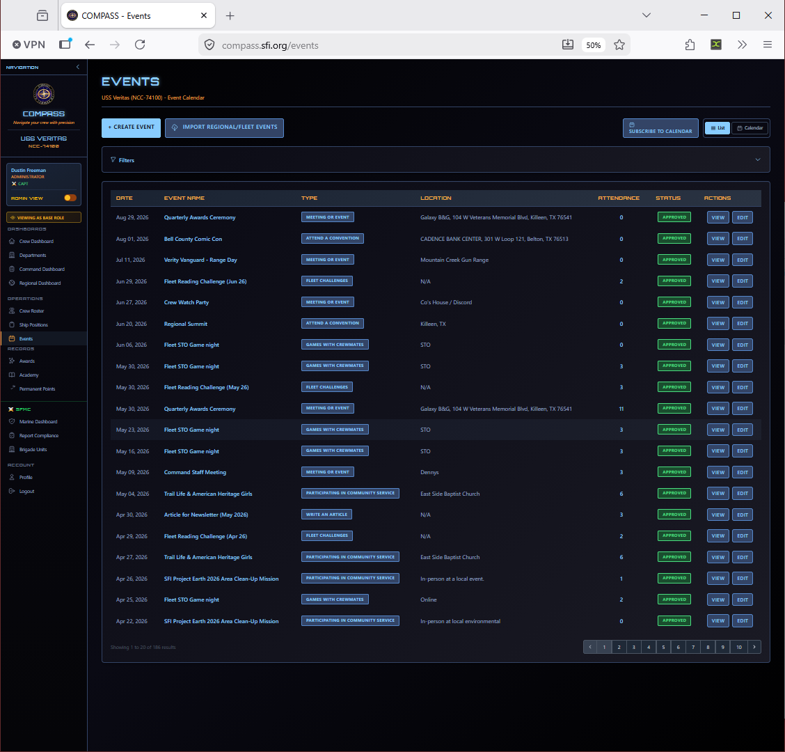
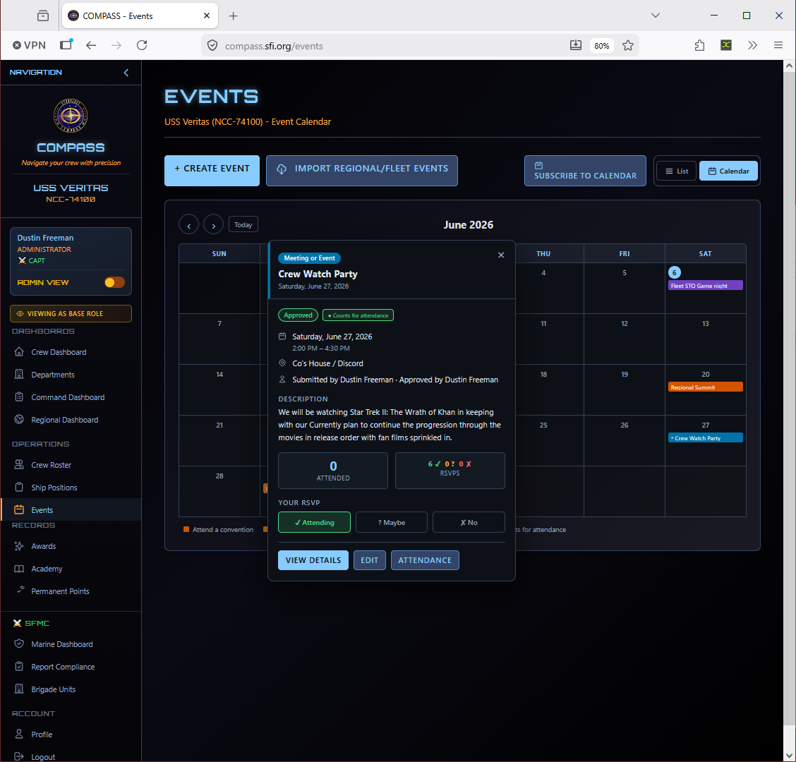

# Events

Event tracking builds the activity record that drives promotion eligibility, award nominations, and monthly reports. Every meeting, activity, and convention appearance should be logged.

Go to **Events** in the left navigation.

---

## Creating an Event

Click **Create Event** from the Events page.

Required fields:

- **Event Name** — A descriptive title (e.g., "June Monthly Meeting", "Regional Summit 2026")
- **Event Type** — Determines point value (see below)
- **Date** — The date the event occurred
- **Attending Crew** — Check each member who attended

---

## Event Types

| Type | Examples |
|---|---|
| **Monthly Meeting** | Regular ship meetings |
| **Ship Activity** | Social events, watch parties, game nights, group outings |
| **Convention** | Regional Summit, local or national cons |
| **Community Service** | Charity work, outreach, public service activities |
| **Training / Academy** | Study groups, test prep sessions |

Point values per event type are configured per ship in **Ship Settings → Event Points**. Your RC may set regional defaults that apply automatically.

---

## Recording Attendance

Check each crew member who attended when creating the event. You can edit attendance after the fact by opening the event and clicking **Edit Attendance**.

!!! tip
    Enter attendance the same day or the next morning. Remembering who attended two weeks later is much harder — and missing attendance means missing points toward promotion eligibility.

---

## Editing or Deleting an Event

Open the event from the Events list and click **Edit** to change any details or update the attendance list. Events can be deleted if entered in error, but deletion is permanent — there's no undo.

!!! warning
    Deleting an event removes all attendance records and the associated points for all attendees. If the event was just entered with the wrong date or wrong type, edit it rather than deleting and re-entering.

---

## How Events Drive Promotions

Each attended event awards the attending crew member a number of activity points, based on the event type's configured point value. These points accumulate toward promotion eligibility requirements. You can see a member's point total and the events driving it on their profile under the **Promotions** tab.

---

## Common Issues

**I forgot to log an event from last month.**
Enter it with the correct past date — no problem. COMPASS doesn't restrict event entry by date.

**A member's attendance isn't showing in their promotion record.**
Open the event and verify they're checked in the attendance list. Also check that the event type has a non-zero point value configured in Ship Settings.

**I entered the wrong event type and points were awarded incorrectly.**
Edit the event and change the type. Points will recalculate automatically.
