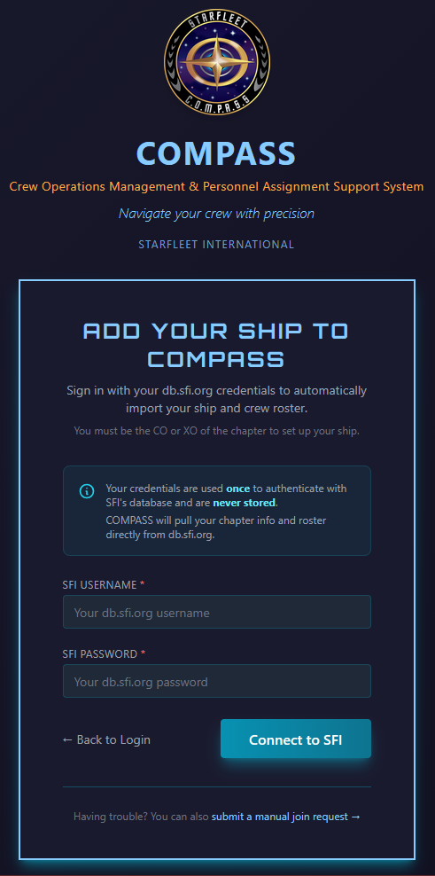
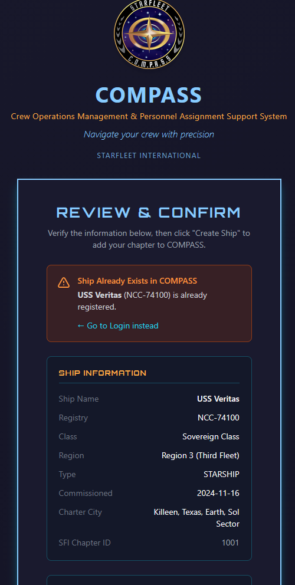
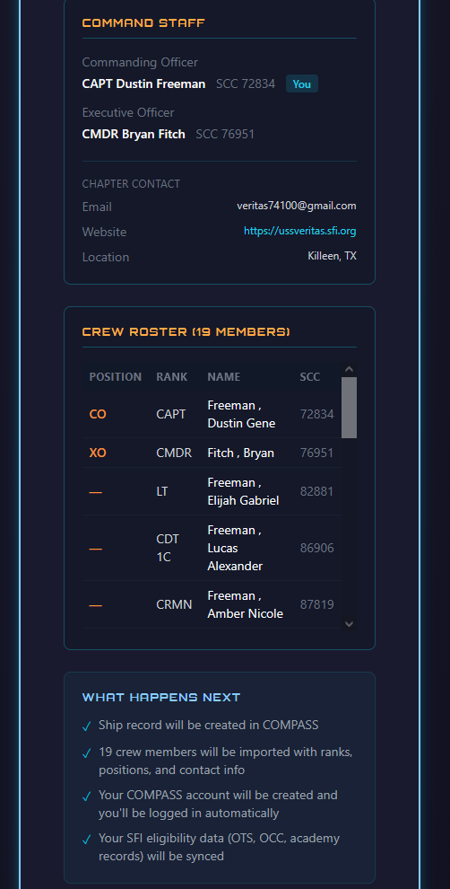

# Getting Started

This guide walks you through setting up your ship in COMPASS for the first time. The process takes about five minutes and is largely automatic — COMPASS pulls your ship data and crew roster directly from the SFI Members Portal.

---

## Before You Begin

You'll need:

- Your **db.sfi.org username and password** (your SFI database credentials — not a COMPASS password)
- To be listed as **CO or XO** of your chapter in db.sfi.org — setup will fail if you're not

!!! note "These are your SFI credentials, not a COMPASS account"
    COMPASS uses your db.sfi.org credentials **once** to pull your chapter info and roster. They are never stored. If you don't have db.sfi.org credentials, log in at [db.sfi.org](https://db.sfi.org) first to set them up.

---

## Step 1 — Enter Your SFI Credentials

Go to **[compass.sfi.org](https://compass.sfi.org)** and click **Add Your Ship to COMPASS** on the login page.

{ width=420 }

Enter your db.sfi.org username and password and click **Connect to SFI**. COMPASS authenticates against the SFI database and fetches your chapter information and roster. A loading spinner will appear while it works.

!!! warning "Only CO or XO can run setup"
    COMPASS verifies your role against db.sfi.org. If you're not listed as CO or XO, you'll see an error: *"Only the Commanding Officer or Executive Officer can set up a ship in COMPASS."* Have your CO or XO run setup instead.

**Common errors at this step:**

- *"Unable to authenticate"* — double-check your db.sfi.org username and password. Log in at db.sfi.org directly to confirm they work.
- *"Unable to retrieve chapter information"* — your account authenticated but has no CO/XO role on file. Contact your RC.

---

## Step 2 — Select Your Chapter (if prompted)

If your SFI account is associated with more than one chapter, COMPASS will show a chapter selection screen. Pick the chapter you're setting up and continue. If you only have one chapter, this step is skipped automatically.

---

## Step 3 — Review Your Ship Information

COMPASS displays a **Review & Confirm** page showing everything pulled from db.sfi.org.

{ width=420 }

{ width=420 }

The page shows:

- **Ship Information** — name, registry, class, region, type, commissioned date, charter city
- **Command Staff** — CO and XO with SCCs; your name will have a **You** badge
- **Crew Roster Preview** — every member COMPASS found in your db.sfi.org roster, with position, rank, name, and SCC

**Review this carefully.** If the ship name, registry, or command staff looks wrong, click **← Start Over** and contact your RC — the data comes directly from db.sfi.org, so any errors need to be corrected there first.

!!! warning "Ship already exists in COMPASS"
    If your ship has already been set up, you'll see an orange warning banner and the Create Ship button won't appear. Contact your RC to get access to the existing record.

---

## Step 4 — Create Ship & Import Crew

If everything looks correct, click **Create Ship & Import Crew**.

COMPASS will:

1. Create your ship record — name, registry, class, region, and all chapter details
2. Import your entire crew roster — all members from db.sfi.org are added with their ranks, positions, and SCCs
3. Create your COMPASS account — you're automatically logged in after setup
4. Sync your eligibility data — OTS/OCC completions and academy records are pulled from db.sfi.org

!!! note "Don't close the page"
    A loading spinner appears while provisioning runs. This can take 10–15 seconds depending on roster size. Don't close or refresh the page while it's working.

---

## Step 5 — You're In

On success, COMPASS redirects you to the **Command Dashboard** with a confirmation message. Your ship is live with your full roster already imported.

---

## After Setup — What to Do Next

### Set Your Password

Your COMPASS account was created automatically. Go to **Profile → Change Password** and set a permanent password before logging out.

### Verify Your Roster

Go to **Crew** and scan through your imported roster. Check that all active members are present and ranks look correct. If someone is missing, it means they weren't on your chapter's roster in db.sfi.org.

### Invite Your XO

Your XO was imported as a crew member but may not have a COMPASS account yet. Direct them to [compass.sfi.org](https://compass.sfi.org) to register — they'll need to use the same email or SCC on file. Their command permissions apply automatically once their account is active.

### Log Your First Event

Go to **Events → Create Event** and enter your most recent ship meeting. See the [Events Guide](events.md).

---

## Troubleshooting

**Setup failed partway through.**
The setup runs as a single transaction — if anything fails, nothing is saved. You can safely run it again from the start.

**My roster shows 0 members.**
Your chapter may not have a roster on file in db.sfi.org. Your ship record will still be created — add crew manually via **Crew → Add Member**.

**I already have a COMPASS account.**
That's fine — COMPASS detects your existing account by SCC and links it to the new ship rather than creating a duplicate.

**My ship was previously in COMPASS but was withdrawn.**
COMPASS reactivates it automatically if your registry matches a withdrawn ship. Historical data (awards, promotion history, events) is fully preserved. Crew members will need to rejoin through the normal join request process.
