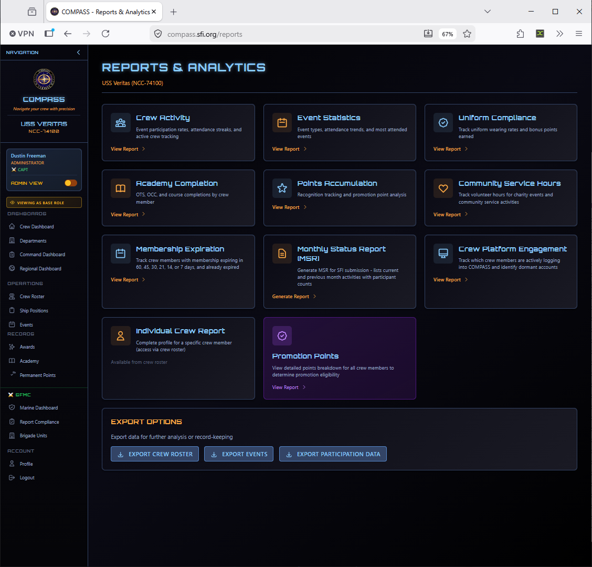
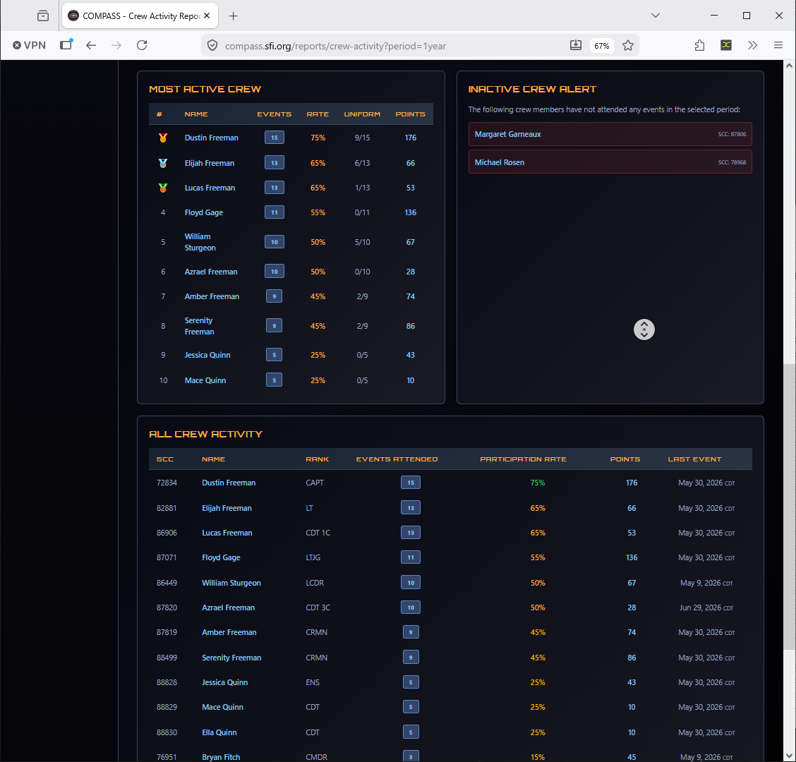
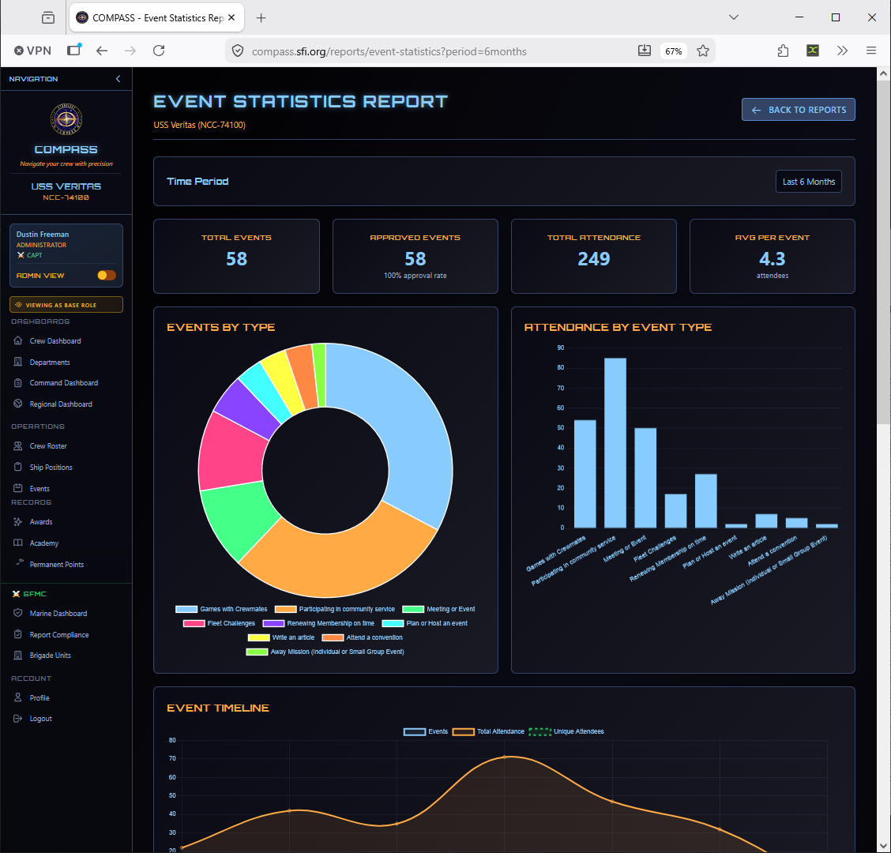
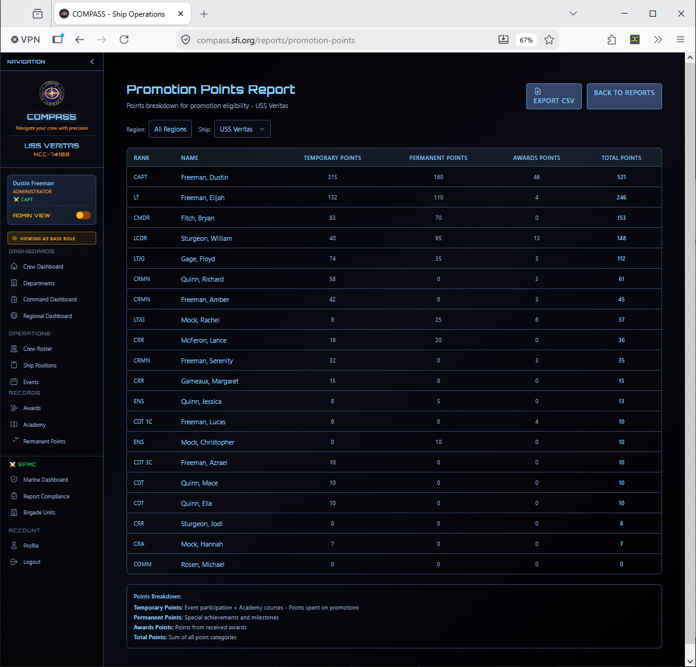
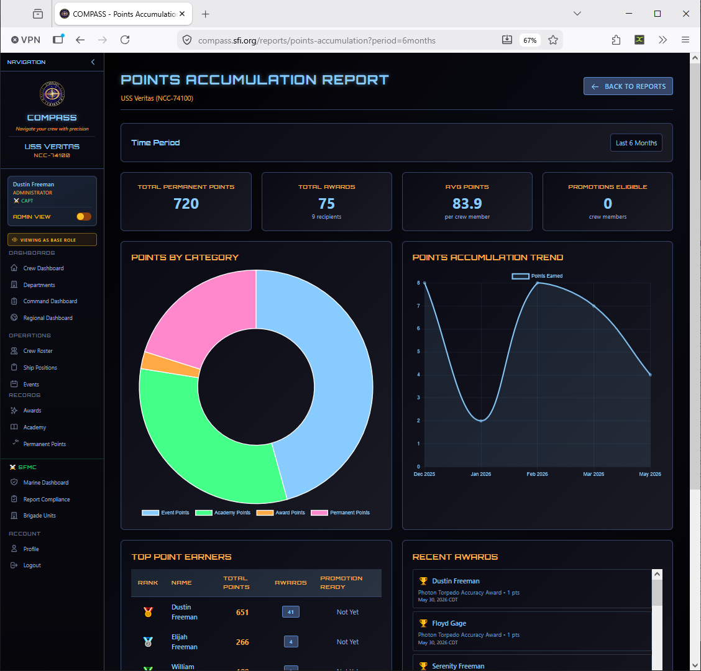
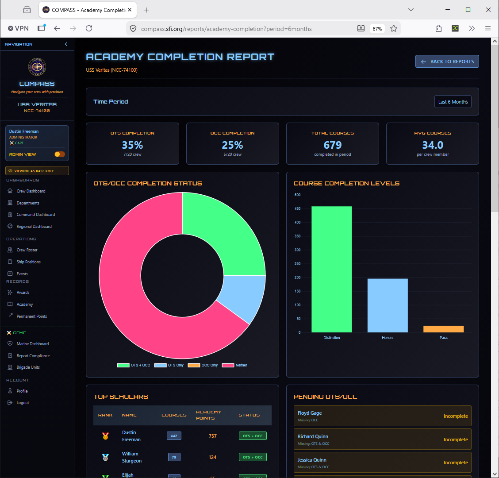
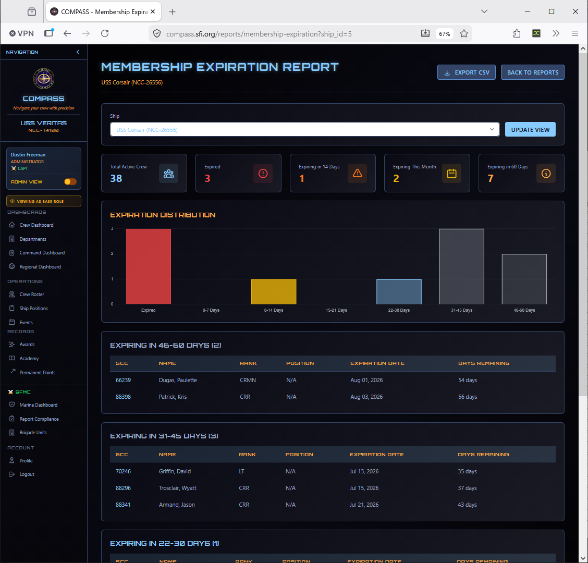
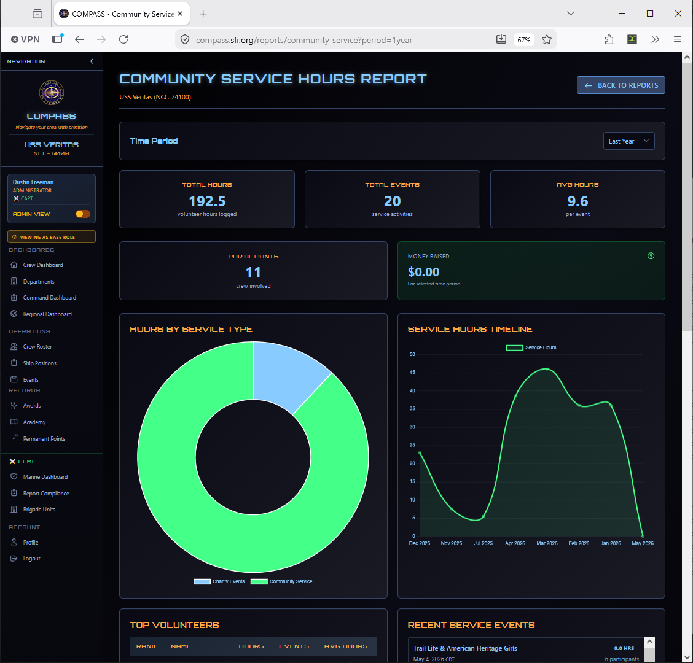
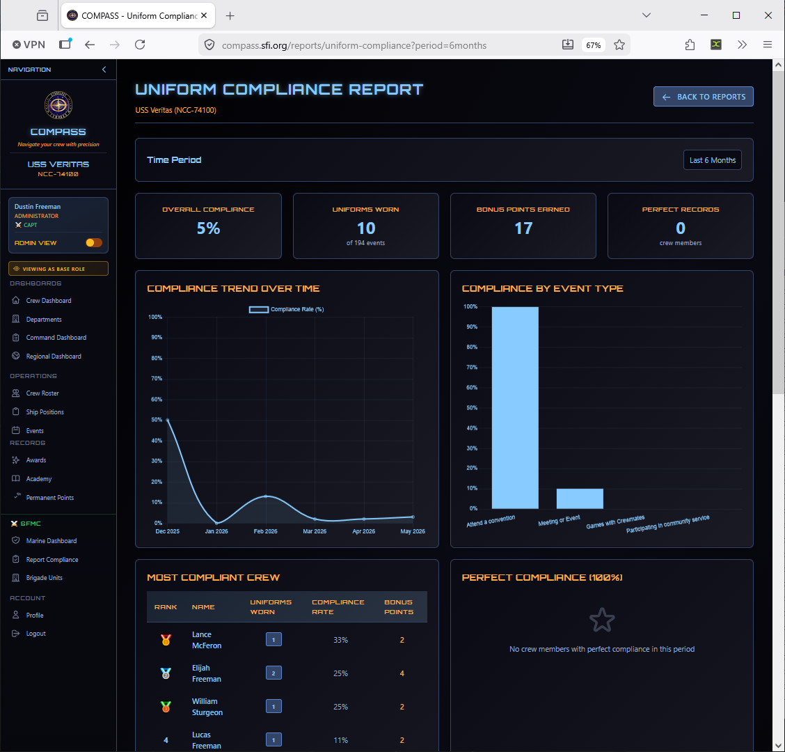
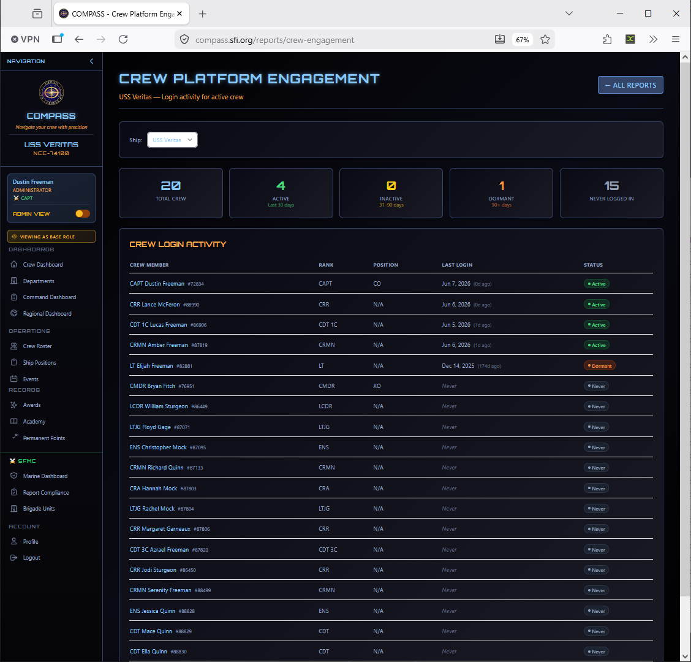

# Reports

COMPASS includes a full suite of reports for monitoring your ship's health, tracking crew activity, and generating required SFI submissions.

Go to **Command Dashboard → Reports** to reach the Reports & Analytics page.

---

## Available Reports

### Crew Activity Report

Shows event participation rates, attendance streaks, active crew tracking, and an **Inactive Crew Alert** highlighting members who haven't attended any events in the selected period.

Use this report monthly to identify members who may be slipping into inactivity before they actually leave.

---

### Event Statistics Report

Breaks down your events by type, attendance trends, and most-attended events over a selectable time period.

---

### Promotion Points Report

Shows a detailed points breakdown for all crew members — event points, academy points, permanent points, and total — to help determine promotion eligibility at a glance.

---

### Points Accumulation Report

Tracks recognition and promotion point trends across your crew over time.

---

### Academy Completion Report

Shows OTS, OCC, and academy course completions by crew member. Useful for identifying who needs training to qualify for command roles.

---

### Membership Expiration Report

Tracks crew members with memberships expiring in the next 60, 45, 30, 21, 14, or 7 days, and those already expired. Run this monthly before submitting reports to avoid losing crew to lapsed memberships.

---

### Community Service Hours Report

Tracks volunteer hours from community service event types across your crew.

---

### Uniform Compliance Report

Tracks uniform wearing rates and bonus points earned for crew who wear their uniform to events.

---

### Crew Platform Engagement

Shows which crew members are actively logging into COMPASS and identifies dormant accounts — useful for following up with members who may not know the platform exists.

---

### Monthly Status Report (MSR)

Generates the MSR for SFI submission, listing current and previous month activity with participant counts.

.png)

!!! tip
    Run the MSR report at the end of each month, review for accuracy, and submit to your RC. The RC manual requires monthly submission — COMPASS does the counting for you, but you still need to formally submit.

---

### Individual Crew Report

A complete profile report for a specific crew member. Access this from the crew roster by clicking a member's name rather than from the main Reports page.

---

## Exporting Data

The bottom of the Reports page has three export buttons:

| Export | Contents |
|---|---|
| **Export Crew Roster** | Full crew list with ranks, statuses, and SCCs |
| **Export Events** | All events with dates, types, and attendance counts |
| **Export Participation Data** | Per-member event attendance and points data |

Exports are CSV format, suitable for Excel or Google Sheets.
