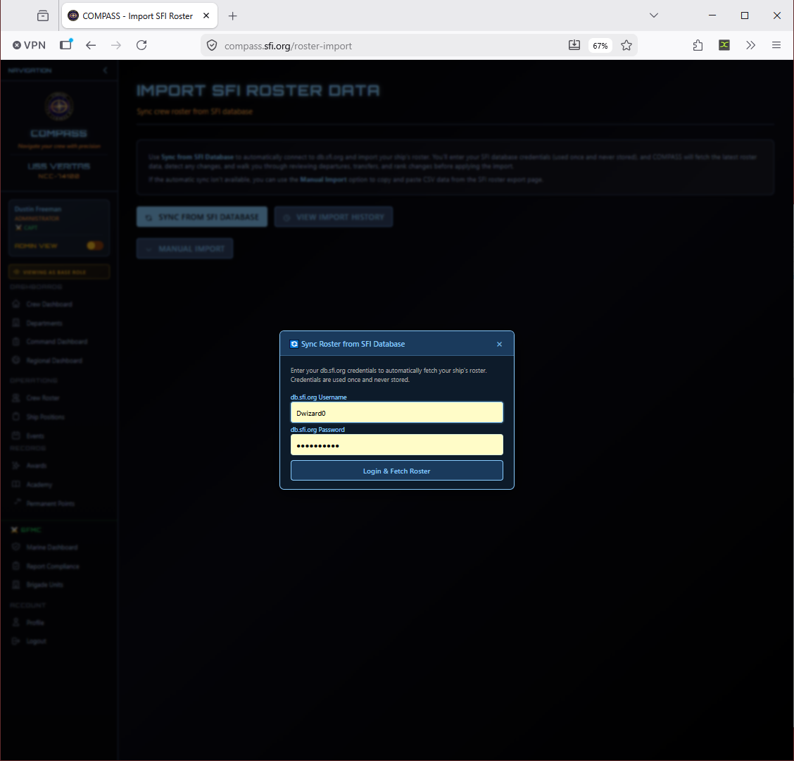

# Managing Your Roster

Your crew roster is the foundation of everything in COMPASS — promotion eligibility, event attendance, awards, and reports all depend on an accurate roster.

Go to **Crew Roster** in the left navigation to view your full ship roster.

---

## Member Statuses

| Status | Meaning |
|---|---|
| **Active** | Full member, counts toward all reports and promotion tracking |
| **Reserve** | Limited participation, still on roster |
| **LOA** | Leave of Absence — temporarily inactive, intends to return |
| **Inactive** | No current participation |
| **Transferred** | Moved to another ship |
| **Retired** | Left SFI or the chapter |

!!! tip
    Use **LOA** for members who plan to return. **Inactive** is for members who have stopped participating but haven't formally left. Avoid using **Retired** unless the member has actually departed — it removes them from active reporting.

---

## Adding a Crew Member

Go to **Crew Roster → Add Member**. Required fields: SCC, full name, rank, and status. Recommended: email address and join date.

!!! warning "Duplicate SCCs"
    COMPASS won't allow two members with the same SCC on the same ship. If you get a duplicate error, check whether they're already on your roster under a slightly different name, or contact your RC if they appear on another ship.

---

## Editing a Crew Member

Click any member's name to open their profile, then click **Edit** to update their information. From a member's profile you can also update their rank, change their status, manage department assignments, and view their promotion and awards history.

---

## Importing Your Roster from SFI

If your ship's roster in db.sfi.org has changed — new members joined, ranks updated — you can re-sync directly from the Command Dashboard.

Go to **Command Dashboard → Roster Import**.

Click **Sync from SFI Database** and enter your db.sfi.org credentials when prompted. COMPASS will fetch your latest roster, detect changes (new members, rank changes, departures), and walk you through reviewing those changes before applying the import.

If the automatic sync isn't available, use **Manual Import** to paste CSV data from the SFI roster export page.

!!! note
    Credentials entered here are used once and never stored — the same as the initial ship setup.

---

## Transferring a Member

1. Open the member's profile
2. Go to **Actions → Transfer Member**
3. Select the destination ship and confirm

The member will show as pending on the receiving ship until that ship's CO confirms the transfer. Inter-region transfers require RC approval from both regions.

---

## Ship Positions

Go to **Ship Positions** in the left navigation to view and manage formal position assignments (CO, XO, Department Heads, etc.).

 1.png)

To assign or change a position, go to **Ship Positions → Manage Positions**.

 1.png)

---

## Departments

Go to **Departments** from the Command Dashboard or left navigation to manage your ship's department structure and assign crew.

.png)

Crew not assigned to a department appear in the **Unassigned** count on the Command Dashboard. Assigning crew to departments keeps your org chart accurate and helps with department-level reporting.

---

## Roster Best Practices

- Audit monthly before submitting reports
- Enter new members promptly — don't wait until report time
- Use LOA for members who intend to return, not Inactive
- Never delete members — change their status instead; historical data is preserved

---

## Common Issues

**I added a member but they can't log in.**
They need to register at [compass.sfi.org](https://compass.sfi.org) separately. Their SCC will link their account to your ship automatically.

**A member appears on two ships.**
Contact your RC to resolve. Crew can only have one active assignment at a time.

**Roster import shows a member with the wrong rank.**
db.sfi.org is the source of truth for rank. If the rank is wrong in SFI's database, it needs to be corrected there first, then re-imported.
