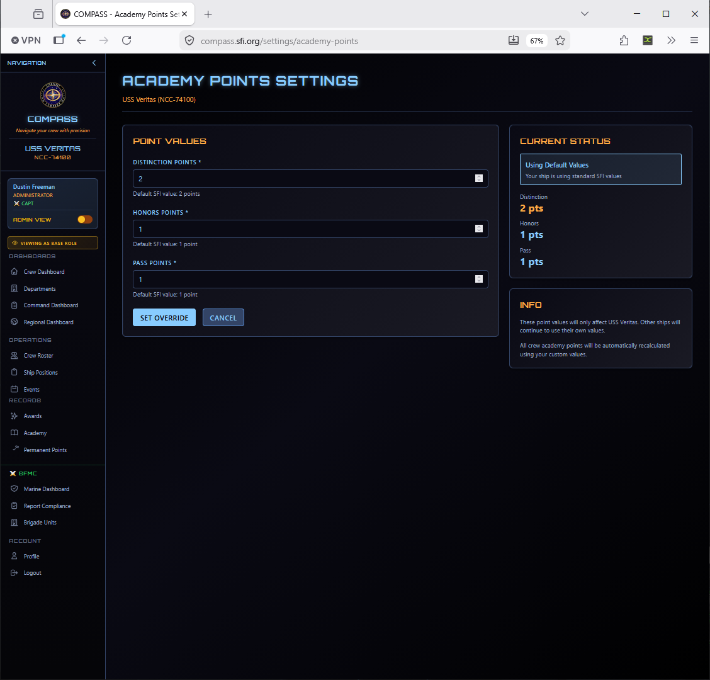
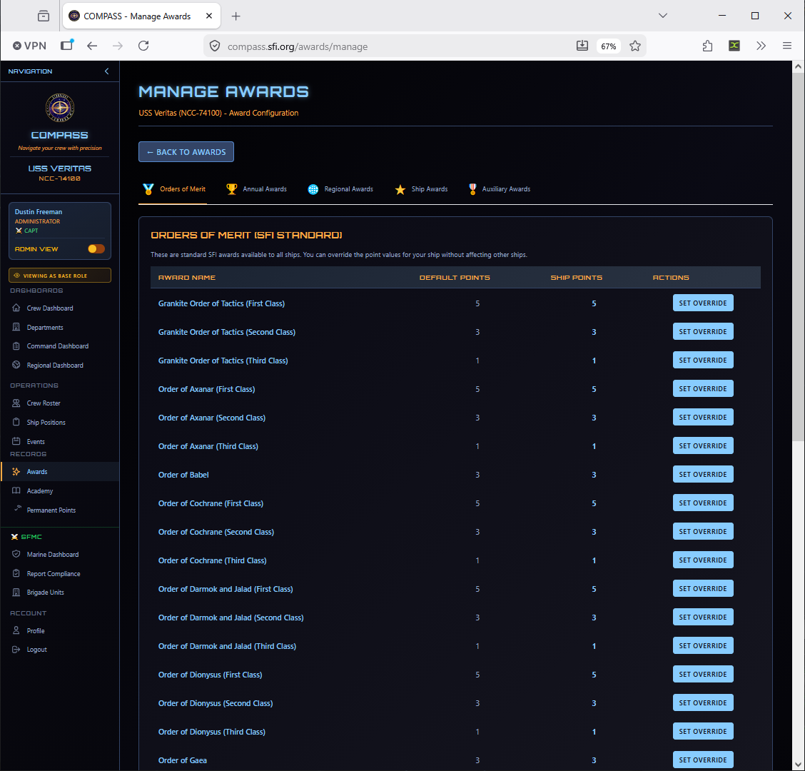
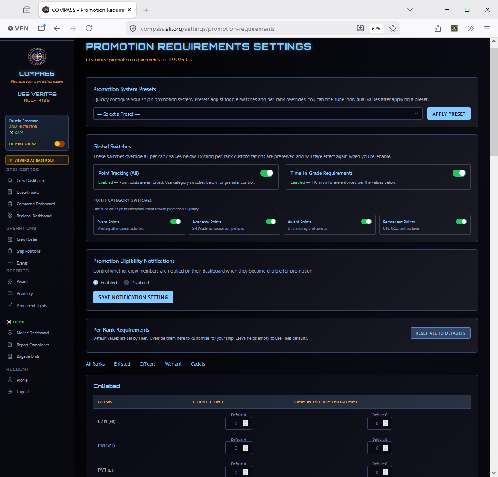
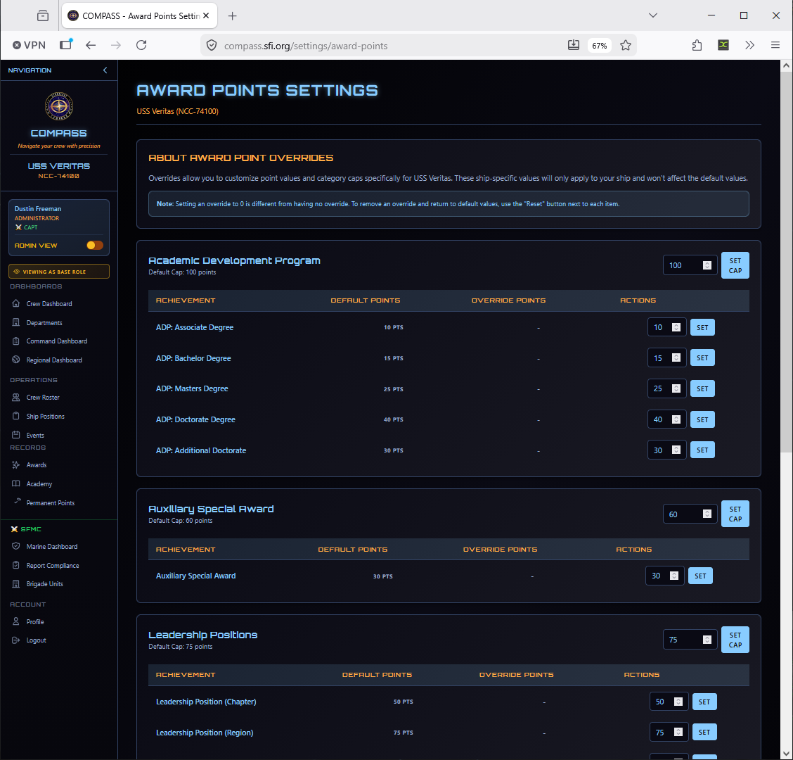
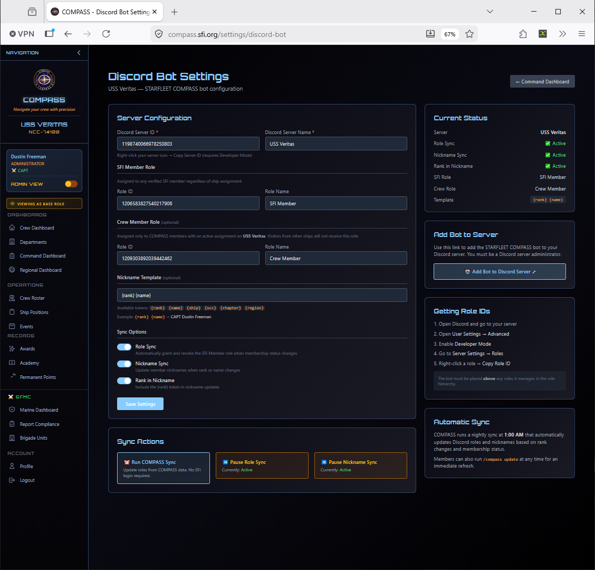
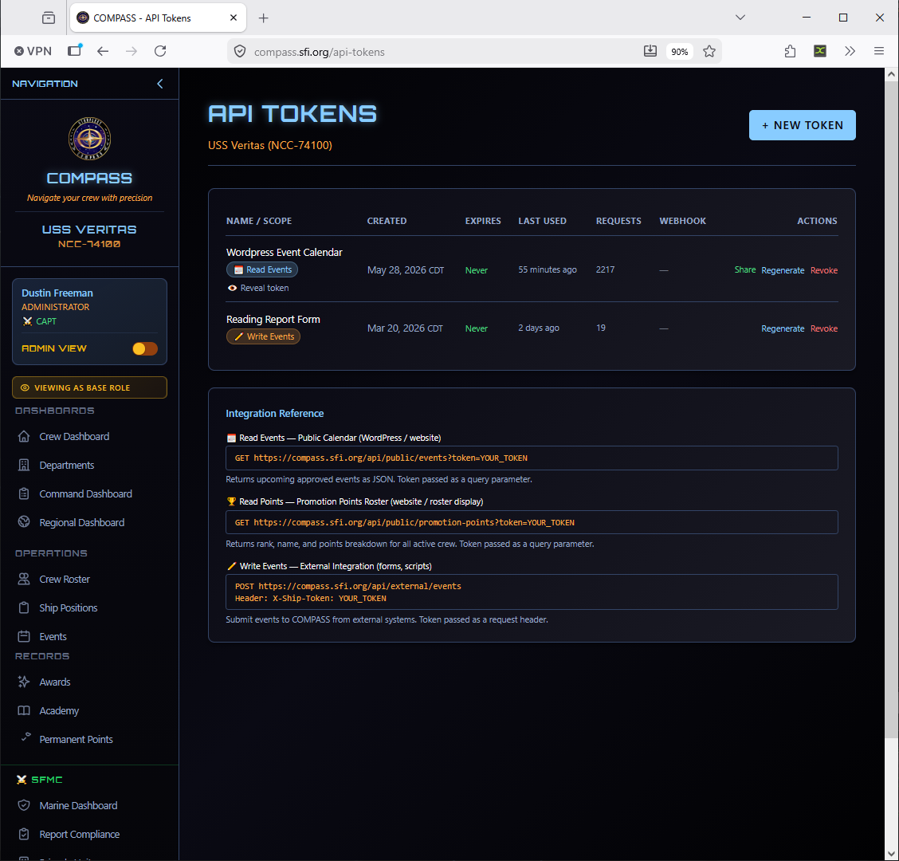

# Ship Settings

Ship Settings controls how COMPASS calculates points and promotion requirements for your ship. All settings here only affect your ship — other ships continue using their own values.

Go to **Command Dashboard → Ship Settings**.

---

## Ship Information

View and edit your ship's basic details — name, registry, class, region, charter city, chapter contact email, and website.

Go to **Command Dashboard → Ship Information** to update these.

---

## Event Points

Configure how many activity points each event type awards to attending crew.

Go to **Ship Settings → Event Points** to set your values. Each event type has a default SFI value shown alongside your ship's current setting. Click **Set Override** to customize.

!!! note
    If your ship is using default values, point calculations automatically follow any regional defaults your RC has configured. Setting a ship-level override locks your ship to your chosen value regardless of regional changes.

---

## Academy Points

Configure point values for academy course completions by grade.

| Grade | Default |
|---|---|
| Distinction | 2 pts |
| Honors | 1 pt |
| Pass | 1 pt |

Override these if your ship uses a different point scale for academy completions.

---

## Award Points

Set the permanent point values awarded when a crew member receives each award. Organized by award category (Orders of Merit, Annual Awards, Regional Awards, Ship Awards, Auxiliary Awards).

Each award shows the default SFI point value and your ship's current override. Click **Set Override** to customize any award's point value for your ship.

---

## Promotion Requirements

Configure the point and time-in-grade requirements for each rank promotion.

For each rank, you can set:

- **Points Required** — Minimum points to be eligible
- **Time in Grade** — Minimum months at current rank before promotion

!!! warning
    Changes to promotion requirements take effect immediately and recalculate all crew eligibility. Review the Promotion Eligibility Report after making changes to see the impact.

---

## Permanent Award Points

Configure how permanent point bonuses are applied for specific award types and leadership positions.

---

## Quick Links

Customize the quick-action links that appear on crew member dashboards. This is how you surface the most relevant resources for your crew — your ship's website, meeting schedule, Discord server, etc.

Go to **Command Dashboard → Quick Links** to manage these.

---

## Discord Bot

If your ship uses a Discord server, COMPASS can sync roles, update member nicknames, and keep your Discord membership list in sync with your COMPASS roster.

Go to **Command Dashboard → Discord Bot** to configure the integration.

---

## API Tokens

For ships or region staff using external integrations, API tokens can be generated here.

Go to **Command Dashboard → API Tokens** to manage tokens.

