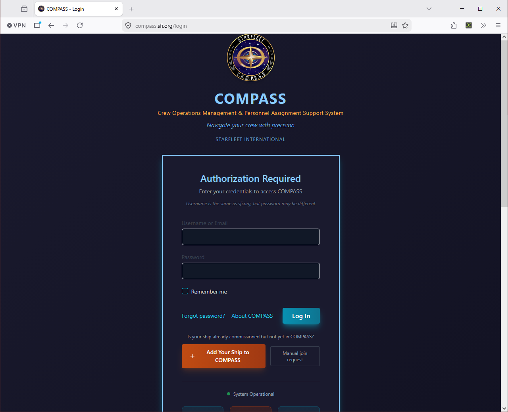
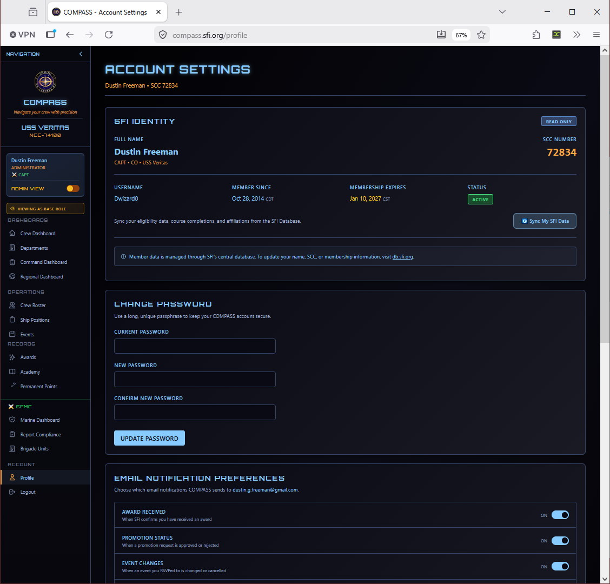

# Crew Member Guide

This guide is for crew members — anyone who is not the CO or XO of their ship.

---

## Logging In

Go to [compass.sfi.org](https://compass.sfi.org) and log in with your COMPASS username and password.

!!! note "First time logging in?"
    Your CO sets up your ship in COMPASS and imports the crew roster. Once imported, you can register at [compass.sfi.org](https://compass.sfi.org) using your SCC number to link your account to your ship. If you're not sure whether your ship is in COMPASS, ask your CO.

If you've forgotten your password, click **Forgot password?** on the login page to reset it by email.

---

## Your Dashboard

After logging in, you'll see your **Crew Dashboard** — a personal summary of your activity in COMPASS.

The dashboard shows:

- **Your rank and ship** — Current rank, position, and ship assignment
- **Recent events** — Events you've attended recently
- **Promotion progress** — Your current point total and how far you are from your next eligible promotion
- **Recent awards** — Awards you've received
- **Quick links** — Links your CO has configured for your ship (website, Discord, meeting schedule, etc.)

---

## Your Profile

Go to **Profile** in the left navigation to view and edit your personal information.

From your profile you can:

- Update your contact information and email address
- Change your password
- View your complete rank history
- View your awards history
- View your academy completions and permanent points

!!! tip
    Keep your email address current — COMPASS sends notifications for promotions, awards, and membership expiration reminders to the address on your profile.

---

## Viewing Your Promotion Progress

Go to **Profile → Promotions Tab** (or check your dashboard summary) to see:

- Your current rank and time-in-grade
- Your current point total broken down by category
- Whether you currently meet the requirements for your next rank
- What's outstanding if you don't yet qualify

---

## Academy Records

Go to **Academy** in the left navigation to view your academy course completion history, including OTS, OCC, and individual course results.

---

## Permanent Points

Go to **Permanent Points** in the left navigation to see your full permanent points breakdown — awards, leadership positions, OTS/OCC completions, and other sources.

---

## Nominating Someone for an Award

Crew members can submit award nominations. Go to **Awards → Nominate** and fill out the nomination form. Your nomination goes to the CO for review before moving to regional approval.

See the [Awards guide](../co-guide/awards.md) for details on how to write a strong citation.

---

## Common Issues

**I can't see my ship's data.**
Make sure your account was registered with the correct SCC. If your SCC doesn't match what your CO imported, contact your CO to reconcile.

**My rank in COMPASS is wrong.**
COMPASS pulls rank from db.sfi.org. If your rank is incorrect, it needs to be corrected in the SFI database first, then your CO can re-sync the roster.

**I'm not receiving email notifications.**
Check that your profile email address is correct and check your spam folder. Notifications are sent from COMPASS automatically for promotions, awards, and membership reminders.
