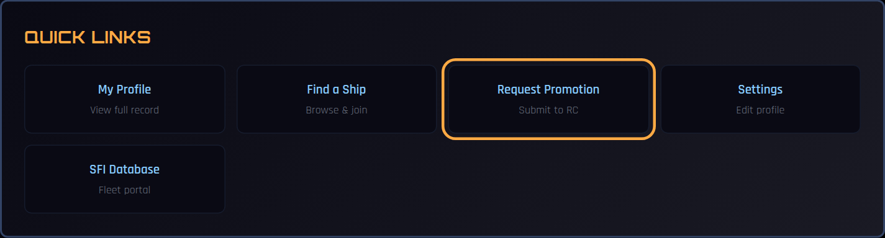
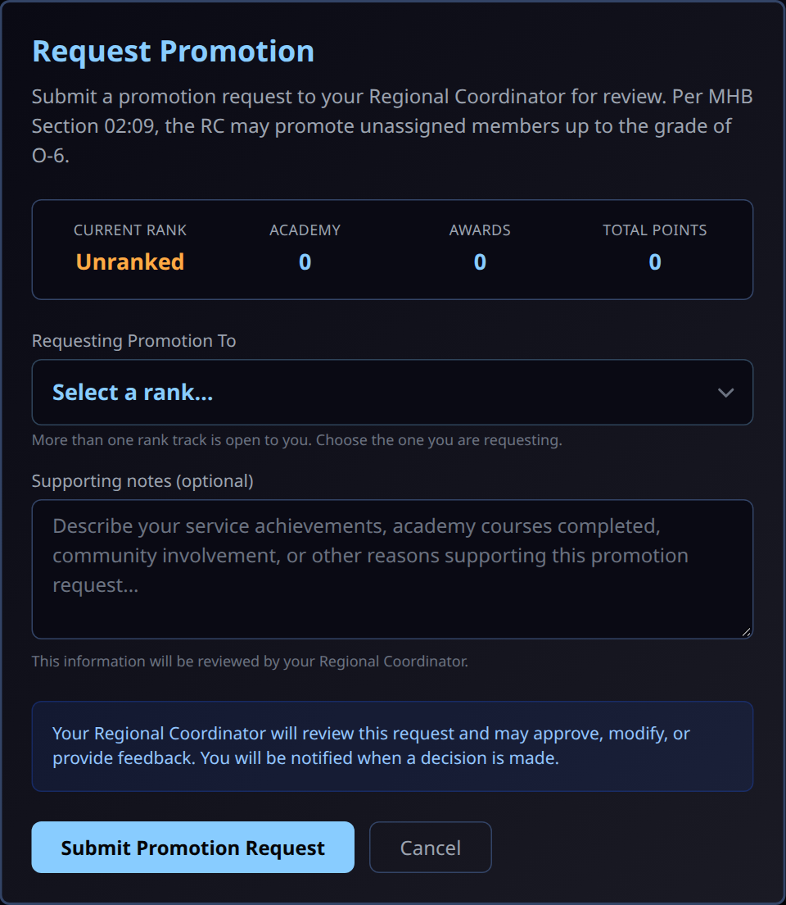
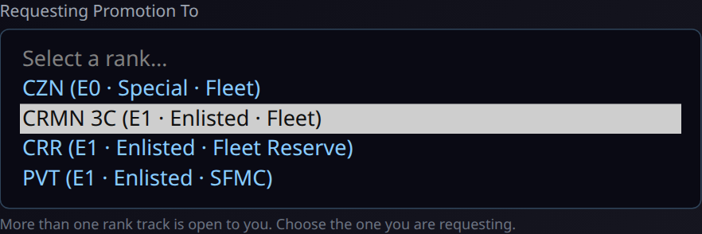
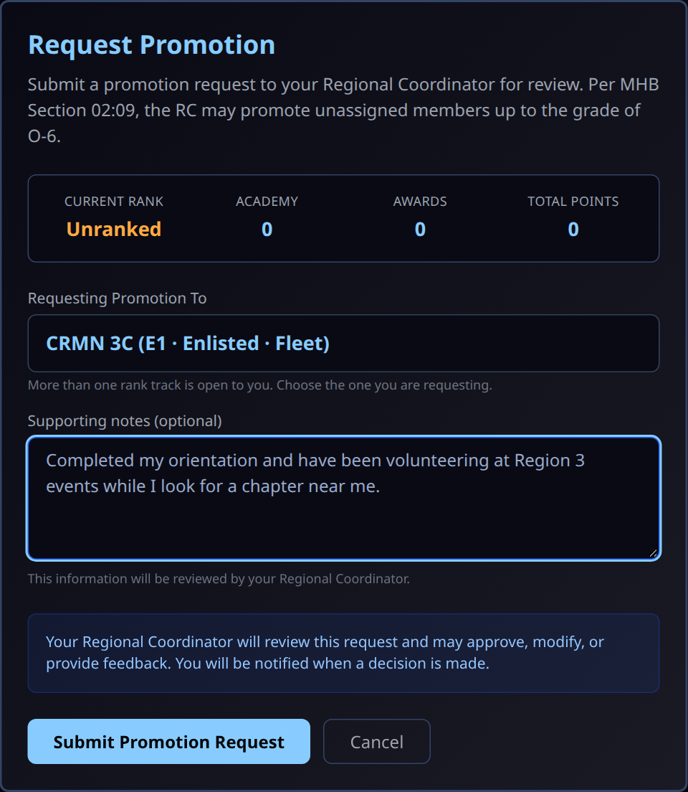
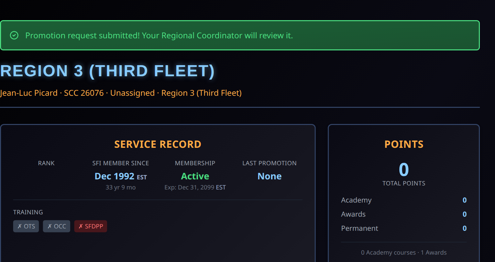
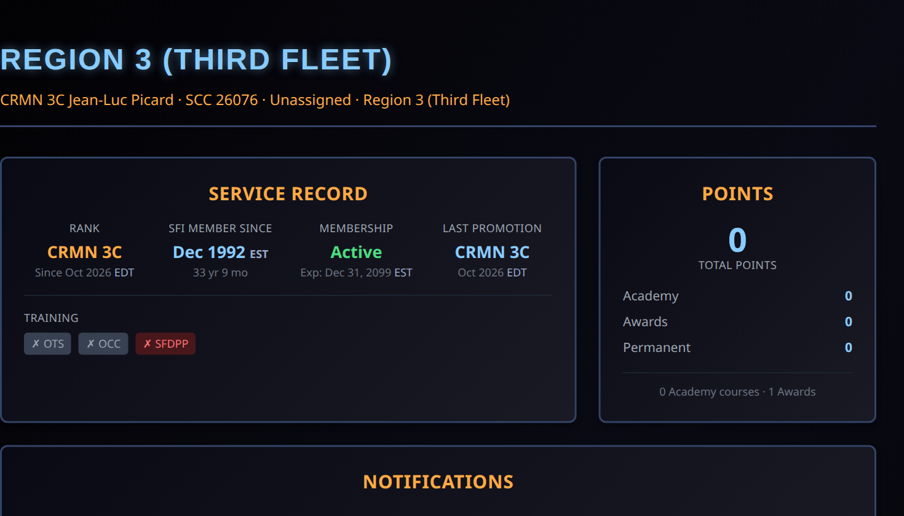

# Requesting a Promotion (Unassigned Members)

If you are an SFI member who is **not on a chapter roster in COMPASS** — you are *unassigned* — you can ask your Regional Coordinator for a promotion yourself. Under MHB Section 02:09 the RC may promote unassigned members up to the grade of **O-6**.

If you are on a ship's roster, your CO handles promotions instead; this page does not apply to you.

---

## Before You Start

- You must be unassigned. Your dashboard shows **No Ship Assignment** in the left navigation.
- You can have **one request pending** at a time. If one is already waiting, the form tells you which rank it is for.
- Promotions to **O-7 and above** (flag ranks) need Executive Committee approval and cannot be requested here.

---

## Step 1 — Open the Request Form

On your dashboard, scroll to **Quick Links** and select **Request Promotion**.

---

## Step 2 — Check Your Current Standing

The form shows your current rank and your point totals from the Academy, awards, and permanent points. Members who have never held a rank show **Unranked**.

---

## Step 3 — Choose the Rank You Are Requesting

COMPASS offers only the **next step** on your own rank track, within what an RC can approve.

When more than one rank is open to you, **Requesting Promotion To** is a drop-down and you choose one. When only one rank is open, it is shown on its own and there is nothing to choose.

{ width="560" }

Each option shows its grade, classification, and service:

| Shown as | Means |
|---|---|
| **Fleet** | The standard Starfleet enlisted and officer ladder |
| **Fleet Reserve** | The Crewman Recruit (CRR) enlisted track |
| **SFMC** | The STARFLEET Marine Corps ladder |

!!! info "Starting your rank track"
    An unranked member is offered **CZN** and the three E-1 entry ranks (**CRMN 3C**, **CRR**, **PVT**). Choosing an E-1 rank is how you choose your track. Members under 18 are also offered **Cadet**, and members who have completed OTS are also offered the O-1 ranks.

    Once you hold a rank, the form offers the next rank on that same track. Moving sideways between tracks (for example Fleet to SFMC) is not something you can request here; talk to your RC.

---

## Step 4 — Add Supporting Notes and Submit

**Supporting notes** are optional but help your RC decide: Academy courses completed, events you have attended or volunteered at, community service, or anything else that supports the request.

Select **Submit Promotion Request**.

!!! note "If your region has no RC in COMPASS"
    The form shows an **External RC Required** box asking for your RC's email address, pre-filled with your region's RC address (for example `rc3@sfi.org`). Your request is emailed to that RC with a secure review link, and they approve or reject it from there.

---

## Step 5 — Confirmation

You return to your dashboard with a confirmation message. Your request is now waiting in your RC's queue.

---

## After Your RC Decides

- **Approved** — your rank updates in COMPASS and you receive a notification. Your dashboard shows the new rank and your **Last Promotion**.
- **Rejected** — the request leaves the RC's queue and you can submit a new one later. COMPASS does not currently send you a notice when a request is rejected, so if you have not heard back, ask your RC.

Your RC also records the promotion in the SFI member database (db.sfi.org). You do not need to do anything there yourself.

---

## Common Questions

**Why can't I choose the rank I want?**
The form only offers the next rank on your current track, and only up to O-6. Skipping ranks, moving to another track, and flag ranks are all decided outside this form. Ask your RC.

**I joined a ship. Can I still use this?**
No. Once you are on a ship's roster, promotions go through your CO. A request you submitted while unassigned stays with your RC.

**Can I change or withdraw a request?**
Contact your RC. While a request is pending you cannot submit another.

---

## Related

- [Rank Chart](../reference/ranks.md)
- For RCs: [Approving Unassigned Member Promotions](../rc-guide/unassigned-promotions.md)
