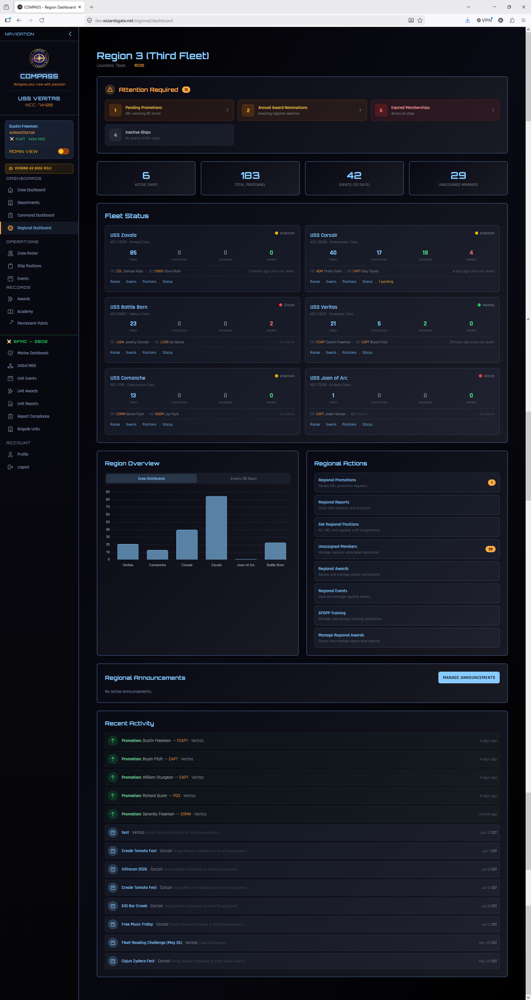

# Regional Dashboard

The Regional Dashboard gives you a bird's-eye view of every ship in your region — health indicators, pending actions, membership status, and SFDPP compliance across your entire fleet.

Go to **Regional Dashboard** in the left navigation. This option only appears if you hold a regional role (RC, VRC, RCOS, or RAO).

---

## What You'll See

### Ship Health Overview

A card or table for each ship in your region showing:

- Ship name and registry
- Active crew count
- Recent event activity
- Pending promotions or awards requiring your attention
- SFDPP compliance status
- Any ships flagged as needing attention

Ships with pending items show a badge count so you know at a glance where action is needed.

### Pending Actions

A consolidated queue of all promotions and award nominations from every ship in your region that are waiting for your review. This is your primary daily working view as RC — clear this queue regularly to keep workflow moving for your COs.

### Region-Wide Membership Expiration

An overview of membership expiration across all ships — who is expiring soon, region-wide. Use this to prompt COs to follow up with members before they lapse.

### SFDPP Compliance

A region-wide view of SFDPP compliance for all role holders across all ships. Any ship with non-compliant command staff will be flagged here.

---

## Navigation in Regional View

When you have both a ship CO role and an RC role, the left navigation shows both **Command Dashboard** and **Regional Dashboard**. These are completely separate views:

- **Command Dashboard** → your ship only (USS Veritas)
- **Regional Dashboard** → all ships in Region 3

The ship displayed in the sidebar header reflects whichever context you're currently working in. You can switch between them freely without losing your place.

---

## Region 3 Ships

| Ship | Registry | Class |
|---|---|---|
| USS Veritas | NCC-74100 | Sovereign Class |
| USS Comanche | NCC-1799 | Constitution Class |
| USS Corsair | NCC-26556 | Ambassador Class |
| USS Zavala | NCC-74709 | Intrepid Class |
| USS Joan of Arc | NCC-73289 | Entente Class |
| USS Battle Born | NCC-69607 | Nebula Class |
