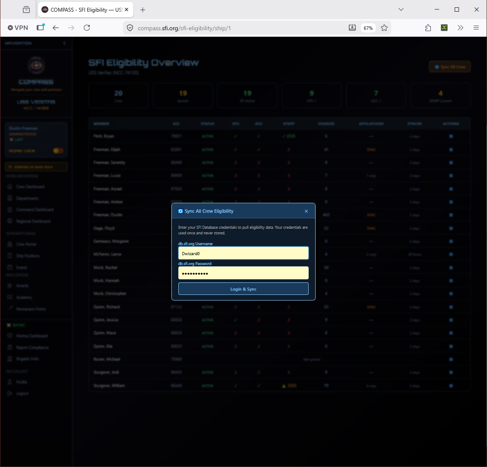
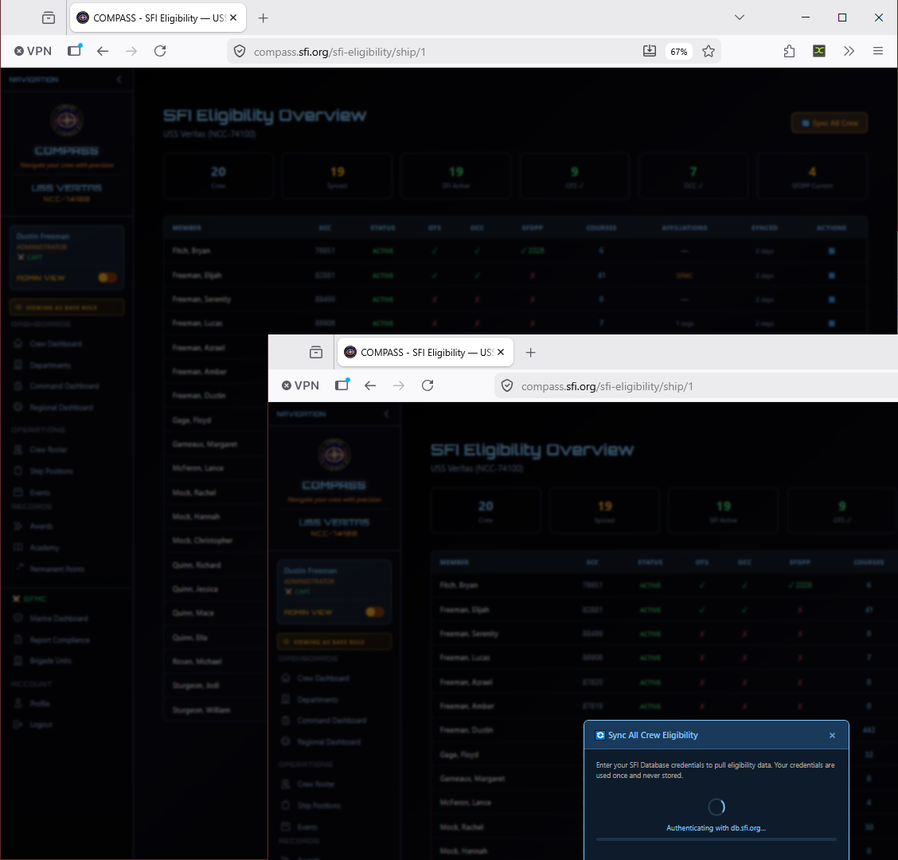
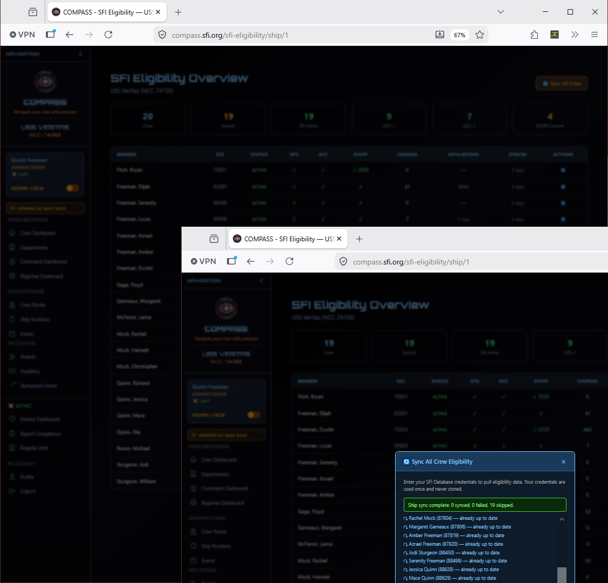

# SFI Eligibility Sync

The SFI Eligibility Sync pulls current membership status, OTS/OCC completions, academy records, and SFI affiliations directly from db.sfi.org for every crew member on a ship. This keeps COMPASS promotion eligibility calculations accurate without requiring manual data entry.

Go to **Command Dashboard → SFI Database Sync** for a single ship, or access it per-ship from the Regional Dashboard.

---

## What Gets Synced

Each sync pulls the following from db.sfi.org for every crew member:

| Field | Description |
|---|---|
| **SFI Status** | Active, expired, or suspended membership status |
| **OTS** | Officer Training School completion |
| **OCC** | Officer Candidate Course completion |
| **SFDPP** | Privacy training compliance status |
| **Courses** | Academy course completions and grades |
| **Affiliations** | SFI chapter affiliations on record |

The SFI Eligibility Overview shows a summary count across all these fields for the ship.

---

## Running a Sync

From the SFI Eligibility Overview page, click **Sync All Crew** in the top right corner.

Enter your db.sfi.org credentials when prompted and click **Login & Sync**. COMPASS will authenticate against db.sfi.org and begin pulling eligibility data for each crew member.

The sync runs crew by crew and shows real-time progress. When complete, a summary banner shows how many records were synced, skipped, or failed.

A result of *"X synced, 0 failed, Y skipped"* is normal — **skipped** means the member's data was already up to date and no changes were needed.

---

## Reading the Eligibility Overview

The overview table shows each crew member with columns for:

| Column | Meaning |
|---|---|
| **SCC** | Member number |
| **Status** | SFI membership status (Active/Expired) |
| **OTS** | ✓ if completed, ✗ if not |
| **OCC** | ✓ if completed, ✗ if not |
| **SFDPP** | ✓ current, ⚠ expiring, ✗ not completed |
| **Courses** | Count of academy courses completed |
| **Affiliations** | SFI chapter affiliations on file |
| **Synced** | How recently data was pulled from db.sfi.org |

Members with warnings or missing requirements will stand out visually — use this view to identify who needs to complete training before their next promotion.

---

## How Often to Sync

Run a sync at least monthly — ideally before processing any promotions or submitting regional reports. Since OTS and OCC completions in db.sfi.org are what gate officer promotions, stale data here is the most common cause of "member shows ineligible but should qualify" issues.

!!! tip
    If a crew member just completed OTS or OCC, run an individual sync for that member immediately rather than waiting for the monthly sync. The sync is fast for a single member.

---

## Individual Member Sync

To sync a single crew member rather than the whole ship, click the sync icon in the **Actions** column next to their row on the eligibility overview page. This is faster for spot-checking after a member completes training.

---

## Common Issues

**Sync failed for a specific member.**
The most common cause is a SCC mismatch — the SCC in COMPASS doesn't match what's on file in db.sfi.org. Check the member's profile and correct the SCC, then retry.

**Member shows OTS incomplete but they finished it.**
Run an individual sync for that member to pull the latest data. If it still shows incomplete after syncing, the completion may not yet be recorded in db.sfi.org — the member should contact their academy administrator.

**Sync completed but SFDPP still shows expired.**
SFDPP expiration is date-based. If the member completed recertification recently, confirm the completion date in db.sfi.org and sync again.
