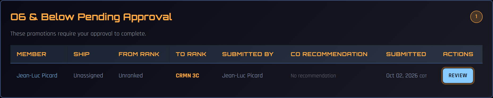
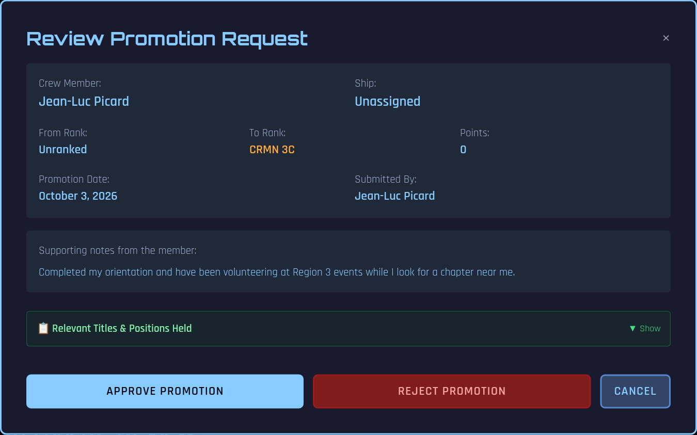
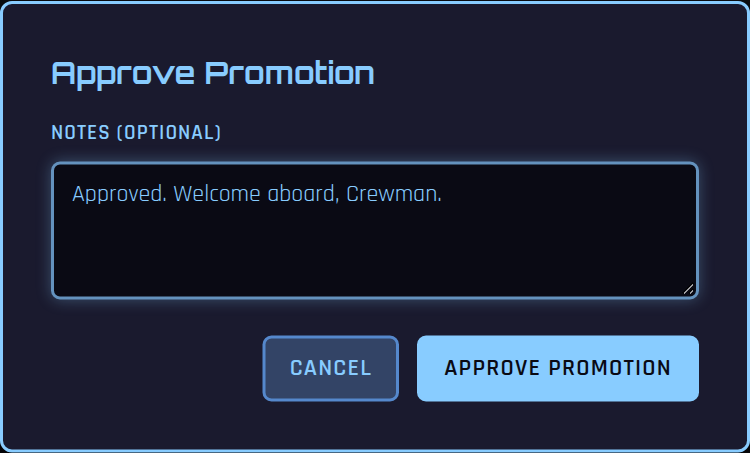
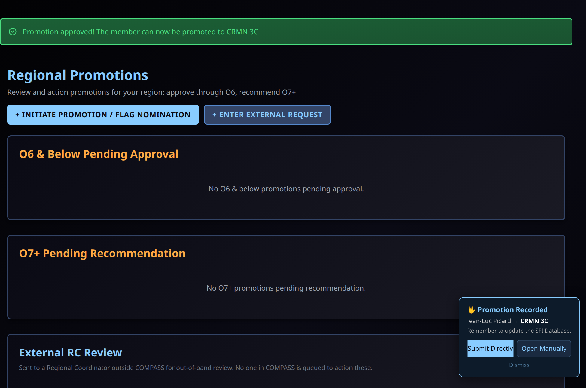

# Approving Unassigned Member Promotions

Members who are not on a chapter roster in COMPASS — *unassigned* members — can request their own promotions. Under MHB Section 02:09 you may promote unassigned members up to **O-6**, so these requests come to you rather than to a CO.

This page walks through reviewing and approving one. For ship promotions and flag nominations, see [Promotions (RC)](promotions.md). For what the member sees, see [Requesting a Promotion (Unassigned Members)](../crew/unassigned-promotion.md).

---

## How Requests Reach You

A member's request lands in **O6 & Below Pending Approval** on your **Regional Promotions** page. The section holds *everything* you approve directly — enlisted, cadet and junior officer requests from unassigned members as well as Captain promotions from ships.

You can tell a self-request at a glance:

- **Ship** is **Unassigned**
- **Submitted By** is the member themselves
- **From Rank** may read **Unranked** for a member who has never held a rank
- **CO Recommendation** is empty — unassigned members have no CO

Select **Review** on the row.

---

## Reviewing the Request

The review panel shows the member, the rank they are requesting, their points, the promotion date, and the **supporting notes they wrote themselves**. There is no CO recommendation section for a self-request.

COMPASS has already limited what the member could ask for: the next rank on their own track, no higher than O-6. An unranked member chooses their track with their first rank — **CRMN 3C** (Fleet), **CRR** (Fleet Reserve) or **PVT** (SFMC) — or **CZN**.

---

## Approving

Select **Approve Promotion**, add optional notes, and confirm with **Approve Promotion**.

{ width="480" }

The member's rank updates in COMPASS straight away and they are notified.

### Rejecting

Select **Reject Promotion** and enter a reason (required). The request leaves your queue, and the member is notified by email and push notification with your reason — so write it for them to read.

---

## Recording It in the SFI Database

After approving, a **Promotion Recorded** prompt appears in the corner of the page:

- **Submit Directly** sends the new rank to db.sfi.org for you.
- **Open Manually** opens the member's rank page on db.sfi.org so you can enter it yourself.
- **Dismiss** closes the prompt.

If you close the prompt without updating db.sfi.org, a reminder stays on your pages until you deal with it. The member is never asked to do this — it is your step.

---

## If Your Region Has No RC in COMPASS

Requests from members in a region without an RC in COMPASS are emailed to the RC address the member enters (normally `rc#@sfi.org`). The email contains a secure review link where the RC can **Approve** or **Reject** without a COMPASS account. These requests appear under **External RC Review** on the Regional Promotions page so regional staff can see them.

---

## Related

- [Promotions (RC)](promotions.md)
- [Requesting a Promotion (Unassigned Members)](../crew/unassigned-promotion.md)
- [Rank Chart](../reference/ranks.md)
